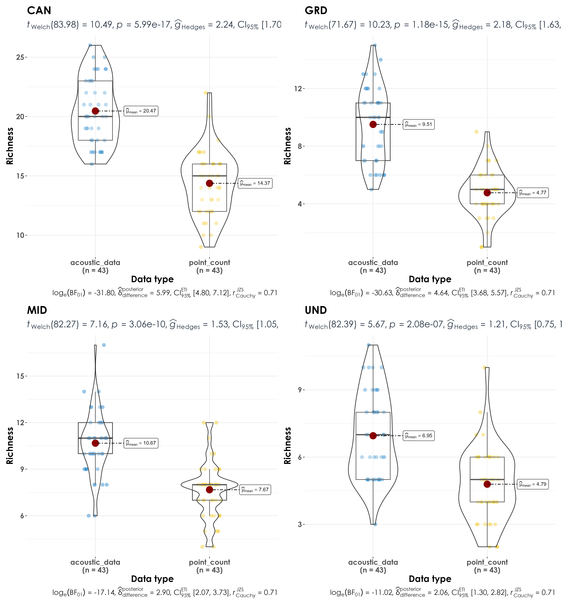

# Richness estimates  

In this script, we will calculate species richness estimates across point count surveys and acoustic data. We estimate differences in species richness by habitat affiliation and foraging guilds.   

## Install necessary libraries
```{r}
library(tidyverse)
library(dplyr)
library(stringr)
library(vegan)
library(ggplot2)
library(scico)
library(data.table)
library(extrafont)
library(ggstatsplot)

# Source any custom/other internal functions necessary for analysis
source("code/01_internal-functions.R")
```

## Load dataframe containing point count and acoustic data
```{r}
datSubset <- read.csv("results/datSubset.csv")
```

## Load species trait data
```{r}
trait <- read.csv("data/species-trait-dat.csv")

# add it to the subset data
datSubset <- left_join(datSubset,trait[,c(1,7,8)], by = "scientific_name")
```

## Estimate richness for point count and acoustic data
```{r}
# point-count data
# estimate total abundance across all species for each site
abundance <- datSubset %>%
  filter(data_type == "point_count") %>%
  group_by(site_id, scientific_name,
           common_name, eBird_codes, habitat, foraging_habit) %>% summarise(totAbundance = sum(number)) %>%
  ungroup()

# total abundance by species
pc_totAbundance <- abundance %>%
  group_by(scientific_name, common_name, habitat, foraging_habit) %>%
  summarise(totAbundance = sum(totAbundance))

# species most abundant in a point count include the Nilgiri flowerpecker, Greenish Warbler, White-cheeked Barbet, Yellow-browed Bulbul, Vernal-hanging Parrot

# estimate richness for point count data (calculated for each site)
pc_richness <- abundance %>%
  mutate(forRichness = case_when(totAbundance > 0 ~ 1)) %>%
  group_by(site_id) %>%
  summarise(richness = sum(forRichness)) %>%
  mutate(data_type = "point_count") %>%
  ungroup()

# estimate total number of detections across the acoustic data
# note: we cannot call this abundance as it refers to the total number of vocalizations across a 15-min period across all sites
detections <- datSubset %>%
  filter(data_type == "acoustic_data") %>%
  group_by(site_id, scientific_name,
           common_name, eBird_codes, habitat, foraging_habit) %>% summarise(totDetections = sum(number)) %>%
  ungroup()

# total number of detections by species
aru_totDetections <- detections %>%
  group_by(scientific_name, common_name, habitat, foraging_habit) %>%
  summarise(totDetections = sum(totDetections))

# species with the highest numbers of acoustic detections across sites are the White-cheeked Barbet, Crimson-backed Sunbird, Nilgiri Flowerpecker, Red-whiskered Bulbul and Greenish Warbler
  
# estimate richness for acoustic data
aru_richness <- detections %>%
  mutate(forRichness = case_when(totDetections > 0 ~ 1)) %>%
  group_by(site_id) %>%
  summarise(richness = sum(forRichness)) %>%
  mutate(data_type = "acoustic_data") %>%
  ungroup()

# how many species were detected in a point count but not acoustic data?
# four species were detected that were not observed in acoustic surveys
pc_not_aru <- anti_join(pc_totAbundance, aru_totDetections)
write.csv(pc_not_aru, "results/species-in-pointCount-not-acoustics.csv", row.names = F)

# how many species were detected in acoustic data but not point counts?
# 31 species were detected in acoustic data, but not in point counts
aru_not_pc <- anti_join(aru_totDetections, pc_totAbundance)
write.csv(aru_not_pc, "results/species-in-acoustics-not-pointCounts.csv", row.names = F)
```

## Visualize differences in richness between point count data and acoustic data
```{r}
richness <- bind_rows(pc_richness, aru_richness)

# Here, we use functions from the package ggstatsplot (more information can be found here:https://indrajeetpatil.github.io/ggstatsplot/index.html)

fig_richness <- richness %>%
  ggbetweenstats(x = data_type,
                         y = richness,
                         xlab = "Data type",
                         ylab = "Richness", 
                         pairwise.display = "significant",
                         package = "ggsci",
                         palette = "default_jco",
    plotgrid.args = list(nrow = 3),
ggplot.component = list(theme(text = element_text(family = "Century Gothic", size = 15, face = "bold"),plot.title = element_text(family = "Century Gothic",
      size = 18, face = "bold"),
      plot.subtitle = element_text(family = "Century Gothic", 
      size = 15, face = "bold",color="#1b2838"),
      axis.title = element_text(family = "Century Gothic",
      size = 15, face = "bold"))))

ggsave(fig_richness, filename = "figs/fig_richness.png", width = 13, height = 14, device = png(), units = "in", dpi = 300)
dev.off() 
```


## Visualize differences in richness as a function of species habitat affiliation  

Here, we examine if there are differences in species richness between point counts and acoustic surveys as a function of habitat affiliation - whether a species is a rainforest specialist or an open-country generalists.  
```{r}
# estimate richness by trait for point count data
trait_pc_richness <- abundance %>%
  mutate(forRichness = case_when(totAbundance > 0 ~ 1)) %>%
  group_by(site_id, habitat) %>% 
  summarise(richness = sum(forRichness)) %>%
  mutate(data_type = "point_count") %>%
  ungroup()

# estimate richness by trait for acoustic data
trait_aru_richness <- detections %>%
  mutate(forRichness = case_when(totDetections > 0 ~ 1)) %>%
  group_by(site_id, habitat) %>%
  summarise(richness = sum(forRichness)) %>%
  mutate(data_type = "acoustic_data") %>%
  ungroup()

# bind rows prior to visualization
trait_richness <- bind_rows(trait_pc_richness, trait_aru_richness)

# visualization
fig_trait_richness <- trait_richness %>%
  grouped_ggbetweenstats(x = data_type,
                         y = richness,
                         grouping.var = habitat,
                         xlab = "Data type",
                         ylab = "Richness", 
                         pairwise.display = "significant",
                         package = "ggsci",
                         palette = "default_jco",
ggplot.component = list(theme(text = element_text(family = "Century Gothic", size = 15, face = "bold"),plot.title = element_text(family = "Century Gothic",
      size = 18, face = "bold"),
      plot.subtitle = element_text(family = "Century Gothic", 
      size = 15, face = "bold",color="#1b2838"),
      axis.title = element_text(family = "Century Gothic",
      size = 15, face = "bold"))))

ggsave(fig_trait_richness, filename = "figs/fig_richness_by_trait.png", width = 13, height = 14, device = png(), units = "in", dpi = 300)
dev.off() 
```

  

## Visualize differences in species richness as a function of species foraging guilds  

Here, we examine if there are differences in species richness between point counts and acoustic surveys as a function of foraging guilds - whether a species forages on the ground, understorey, mid-storey, or canopy.   
```{r}
# estimate richness by foraging habit for point count data
foraging_pc_richness <- abundance %>%
  mutate(forRichness = case_when(totAbundance > 0 ~ 1)) %>%
  group_by(site_id,foraging_habit) %>% 
  summarise(richness = sum(forRichness)) %>%
  mutate(data_type = "point_count") %>%
  filter(foraging_habit != "AER") %>%
  filter(foraging_habit != "AQU") %>%
  ungroup()

# estimate richness by foraging habit for acoustic data
foraging_aru_richness <- detections %>%
  mutate(forRichness = case_when(totDetections > 0 ~ 1)) %>%
  group_by(site_id, foraging_habit) %>%
  summarise(richness = sum(forRichness)) %>%
  mutate(data_type = "acoustic_data") %>%
  filter(foraging_habit != "AER") %>%
  filter(foraging_habit != "AQU") %>%
  ungroup()

# bind rows prior to visualization
foraging_richness <- bind_rows(foraging_pc_richness, foraging_aru_richness)

# visualization
fig_foraging_richness <- foraging_richness %>%
  grouped_ggbetweenstats(x = data_type,
                         y = richness,
                         grouping.var = foraging_habit,
                         xlab = "Data type",
                         ylab = "Richness", 
                         pairwise.display = "significant",
                         package = "ggsci",
                         palette = "default_jco",
ggplot.component = list(theme(text = element_text(family = "Century Gothic", size = 15, face = "bold"),plot.title = element_text(family = "Century Gothic",
      size = 18, face = "bold"),
      plot.subtitle = element_text(family = "Century Gothic", 
      size = 15, face = "bold",color="#1b2838"),
      axis.title = element_text(family = "Century Gothic",
      size = 15, face = "bold"))))

ggsave(fig_foraging_richness, filename = "figs/fig_richness_by_foragingGuild.png", width = 13, height = 14, device = png(), units = "in", dpi = 300)
dev.off() 
```



## Stacked barplots for richness across foraging guilds  

```{r}
# reordering factors for plotting
foraging_richness$foraging_habit <- factor(foraging_richness$foraging_habit, levels = c("GRD","UND","MID","CAN"))

fig_stacked_forHabit <- ggbarstats(
  data = foraging_richness,
  x = foraging_habit,
  y = data_type,
  counts = richness,
  perc.k = 1,
  package = "ggsci",
  palette = "category10_d3",
  plotgrid.args = list(nrow = 3),
 ggplot.component = list(theme(text = element_text(family = "Century Gothic", size = 15, face = "bold"),plot.title = element_text(family = "Century Gothic",
      size = 18, face = "bold"),
      plot.subtitle = element_text(family = "Century Gothic", 
      size = 15, face = "bold",color="#1b2838"),
      axis.title = element_text(family = "Century Gothic",
      size = 15, face = "bold"))))

ggsave(fig_stacked_forHabit, filename = "figs/fig_foragingHabit_stackedRichness.png", width = 13, height = 12, device = png(), units = "in", dpi = 300)
dev.off() 
```

 
