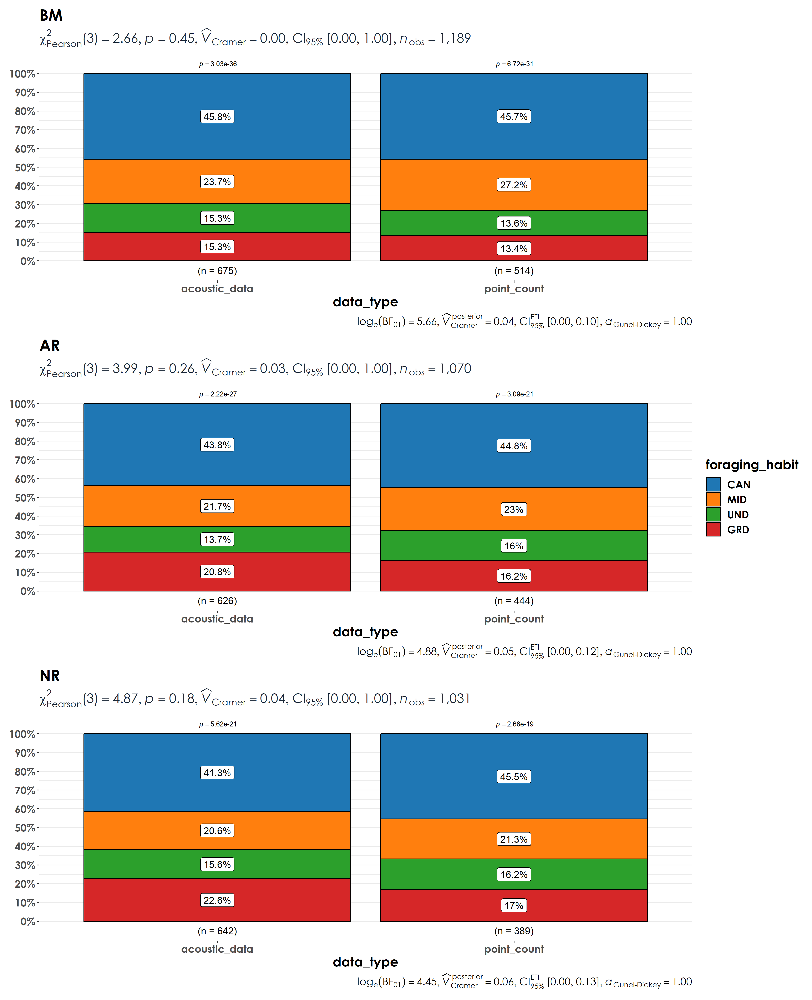

# Richness estimates  

In this script, we will calculate species richness estimates across point count surveys and acoustic data. We estimate differences in species richness by habitat affiliation and foraging guilds.   

## Install necessary libraries
```{r}
library(tidyverse)
library(dplyr)
library(stringr)
library(vegan)
library(ggplot2)
library(scico)
library(data.table)
library(extrafont)
library(ggstatsplot)

# Source any custom/other internal functions necessary for analysis
source("code/01_internal-functions.R")
```

## Load dataframe containing point count and acoustic data
```{r}
datSubset <- read.csv("results/datSubset.csv")
```

## Load species trait data
```{r}
trait <- read.csv("data/species-trait-dat.csv")

# add it to the subset data
datSubset <- left_join(datSubset,trait[,c(1,7,8)], by = "scientific_name")
```

## Estimate richness for point count and acoustic data
```{r}
# point-count data
# estimate total abundance across all species for each site
abundance <- datSubset %>%
  filter(data_type == "point_count") %>%
  group_by(site_id, restoration_type, scientific_name,
           common_name, eBird_codes, habitat, foraging_habit) %>% summarise(totAbundance = sum(number)) %>%
  ungroup()

# estimate richness for point count data
pc_richness <- abundance %>%
  mutate(forRichness = case_when(totAbundance > 0 ~ 1)) %>%
  group_by(site_id,restoration_type) %>%
  summarise(richness = sum(forRichness)) %>%
  mutate(data_type = "point_count") %>%
  ungroup()

# estimate total number of detections across the acoustic data
# note: we cannot call this abundance as it refers to the total number of vocalizations across a 16-min period across all sites
detections <- datSubset %>%
  filter(data_type == "acoustic_data") %>%
  group_by(site_id, restoration_type, scientific_name,
           common_name, eBird_codes, habitat, foraging_habit) %>% summarise(totDetections = sum(number)) %>%
  ungroup()

# estimate richness for acoustic data
aru_richness <- detections %>%
  mutate(forRichness = case_when(totDetections > 0 ~ 1)) %>%
  group_by(site_id,restoration_type) %>%
  summarise(richness = sum(forRichness)) %>%
  mutate(data_type = "acoustic_data") %>%
  ungroup()
```

## Visualize differences in richness between point count data and acoustic data
```{r}
richness <- bind_rows(pc_richness, aru_richness)

# reordering factors for plotting
richness$restoration_type <- factor(richness$restoration_type, levels = c("BM", "AR", "NR"))

# Here, we use functions from the package ggstatsplot (more information can be found here:https://indrajeetpatil.github.io/ggstatsplot/index.html)

fig_richness <- richness %>%
  grouped_ggbetweenstats(x = data_type,
                         y = richness,
                         grouping.var = restoration_type,
                         xlab = "Data type",
                         ylab = "Richness", 
                         pairwise.display = "significant",
                         package = "ggsci",
                         palette = "default_jco",
    plotgrid.args = list(nrow = 3),
ggplot.component = list(theme(text = element_text(family = "Century Gothic", size = 15, face = "bold"),plot.title = element_text(family = "Century Gothic",
      size = 18, face = "bold"),
      plot.subtitle = element_text(family = "Century Gothic", 
      size = 15, face = "bold",color="#1b2838"),
      axis.title = element_text(family = "Century Gothic",
      size = 15, face = "bold"))))

ggsave(fig_richness, filename = "figs/fig_richness.png", width = 13, height = 14, device = png(), units = "in", dpi = 300)
dev.off() 
```


## Visualize differences in richness as a function of species habitat affiliation  

Here, we examine if there are differences in species richness across treatment types (between point counts and acoustic surveys) as a function of habitat affiliation - whether a species is a rainforest specialist or an open-country generalists.  
```{r}
# estimate richness by trait for point count data
trait_pc_richness <- abundance %>%
  mutate(forRichness = case_when(totAbundance > 0 ~ 1)) %>%
  group_by(site_id,restoration_type, habitat) %>% summarise(richness = sum(forRichness)) %>%
  mutate(data_type = "point_count") %>%
  ungroup()

# estimate richness by trait for acoustic data
trait_aru_richness <- detections %>%
  mutate(forRichness = case_when(totDetections > 0 ~ 1)) %>%
  group_by(site_id,restoration_type, habitat) %>%
  summarise(richness = sum(forRichness)) %>%
  mutate(data_type = "acoustic_data") %>%
  ungroup()

# bind rows prior to visualization
trait_richness <- bind_rows(trait_pc_richness, trait_aru_richness)

# reordering factors for plotting
trait_richness$restoration_type <- factor(trait_richness$restoration_type, levels = c("BM", "AR", "NR"))

# visualization for rainforest birds
fig_rf_richness <- trait_richness %>%
  filter(habitat == "RF") %>%
  grouped_ggbetweenstats(x = data_type,
                         y = richness,
                         grouping.var = restoration_type,
                         xlab = "Data type",
                         ylab = "Richness", 
                         pairwise.display = "significant",
                         package = "ggsci",
                         palette = "default_jco",
    plotgrid.args = list(nrow = 3),
ggplot.component = list(theme(text = element_text(family = "Century Gothic", size = 15, face = "bold"),plot.title = element_text(family = "Century Gothic",
      size = 18, face = "bold"),
      plot.subtitle = element_text(family = "Century Gothic", 
      size = 15, face = "bold",color="#1b2838"),
      axis.title = element_text(family = "Century Gothic",
      size = 15, face = "bold"))))

ggsave(fig_rf_richness, filename = "figs/fig_rainforestBirds_richness.png", width = 13, height = 14, device = png(), units = "in", dpi = 300)
dev.off() 

# visualization for open-country birds
fig_oc_richness <- trait_richness %>%
  filter(habitat == "OC") %>%
  grouped_ggbetweenstats(x = data_type,
                         y = richness,
                         grouping.var = restoration_type,
                         xlab = "Data type",
                         ylab = "Richness", 
                         pairwise.display = "significant",
                         package = "ggsci",
                         palette = "default_jco",
    plotgrid.args = list(nrow = 3),
ggplot.component = list(theme(text = element_text(family = "Century Gothic", size = 15, face = "bold"),plot.title = element_text(family = "Century Gothic",
      size = 18, face = "bold"),
      plot.subtitle = element_text(family = "Century Gothic", 
      size = 15, face = "bold",color="#1b2838"),
      axis.title = element_text(family = "Century Gothic",
      size = 15, face = "bold"))))

ggsave(fig_oc_richness, filename = "figs/fig_openCountryBirds_richness.png", width = 13, height = 14, device = png(), units = "in", dpi = 300)
dev.off() 
```

  

      
  
## Visualize differences in species richness as a function of species foraging guilds  

Here, we examine if there are differences in species richness across treatment types (between point counts and acoustic surveys) as a function of foraging guilds - whether a species forages on the ground, understorey, mid-storey, or canopy.   
```{r}
# estimate richness by foraging habit for point count data
foraging_pc_richness <- abundance %>%
  mutate(forRichness = case_when(totAbundance > 0 ~ 1)) %>%
  group_by(site_id,restoration_type, foraging_habit) %>% summarise(richness = sum(forRichness)) %>%
  mutate(data_type = "point_count") %>%
  filter(foraging_habit != "AER") %>%
  filter(foraging_habit != "AQU") %>%
  ungroup()

# estimate richness by trait for acoustic data
foraging_aru_richness <- detections %>%
  mutate(forRichness = case_when(totDetections > 0 ~ 1)) %>%
  group_by(site_id,restoration_type, foraging_habit) %>%
  summarise(richness = sum(forRichness)) %>%
  mutate(data_type = "acoustic_data") %>%
  filter(foraging_habit != "AER") %>%
  filter(foraging_habit != "AQU") %>%
  ungroup()

# bind rows prior to visualization
foraging_richness <- bind_rows(foraging_pc_richness, foraging_aru_richness)

# reordering factors for plotting
foraging_richness$restoration_type <- factor(foraging_richness$restoration_type, levels = c("BM", "AR", "NR"))

# canopy birds visualization
fig_can_richness <- foraging_richness %>%
  filter(foraging_habit == "CAN") %>%
  grouped_ggbetweenstats(x = data_type,
                         y = richness,
                         grouping.var = restoration_type,
                         xlab = "Data type",
                         ylab = "Richness", 
                         pairwise.display = "significant",
                         package = "ggsci",
                         palette = "default_jco",
    plotgrid.args = list(nrow = 3),
ggplot.component = list(theme(text = element_text(family = "Century Gothic", size = 15, face = "bold"),plot.title = element_text(family = "Century Gothic",
      size = 18, face = "bold"),
      plot.subtitle = element_text(family = "Century Gothic", 
      size = 15, face = "bold",color="#1b2838"),
      axis.title = element_text(family = "Century Gothic",
      size = 15, face = "bold"))))

ggsave(fig_can_richness, filename = "figs/fig_canopyBirds_richness.png", width = 13, height = 14, device = png(), units = "in", dpi = 300)
dev.off() 

# midstorey birds visualization
fig_mid_richness <- foraging_richness %>%
  filter(foraging_habit == "MID") %>%
  grouped_ggbetweenstats(x = data_type,
                         y = richness,
                         grouping.var = restoration_type,
                         xlab = "Data type",
                         ylab = "Richness", 
                         pairwise.display = "significant",
                         package = "ggsci",
                         palette = "default_jco",
    plotgrid.args = list(nrow = 3),
ggplot.component = list(theme(text = element_text(family = "Century Gothic", size = 15, face = "bold"),plot.title = element_text(family = "Century Gothic",
      size = 18, face = "bold"),
      plot.subtitle = element_text(family = "Century Gothic", 
      size = 15, face = "bold",color="#1b2838"),
      axis.title = element_text(family = "Century Gothic",
      size = 15, face = "bold"))))

ggsave(fig_mid_richness, filename = "figs/fig_midstoreyBirds_richness.png", width = 13, height = 14, device = png(), units = "in", dpi = 300)
dev.off() 

# understorey birds visualization
fig_und_richness <- foraging_richness %>%
  filter(foraging_habit == "UND") %>%
  grouped_ggbetweenstats(x = data_type,
                         y = richness,
                         grouping.var = restoration_type,
                         xlab = "Data type",
                         ylab = "Richness", 
                         pairwise.display = "significant",
                         package = "ggsci",
                         palette = "default_jco",
    plotgrid.args = list(nrow = 3),
ggplot.component = list(theme(text = element_text(family = "Century Gothic", size = 15, face = "bold"),plot.title = element_text(family = "Century Gothic",
      size = 18, face = "bold"),
      plot.subtitle = element_text(family = "Century Gothic", 
      size = 15, face = "bold",color="#1b2838"),
      axis.title = element_text(family = "Century Gothic",
      size = 15, face = "bold"))))

ggsave(fig_und_richness, filename = "figs/fig_understoreyBirds_richness.png", width = 13, height = 14, device = png(), units = "in", dpi = 300)
dev.off() 

# ground foraging birds visualization
fig_grd_richness <- foraging_richness %>%
  filter(foraging_habit == "GRD") %>%
  grouped_ggbetweenstats(x = data_type,
                         y = richness,
                         grouping.var = restoration_type,
                         xlab = "Data type",
                         ylab = "Richness", 
                         pairwise.display = "significant",
                         package = "ggsci",
                         palette = "default_jco",
    plotgrid.args = list(nrow = 3),
ggplot.component = list(theme(text = element_text(family = "Century Gothic", size = 15, face = "bold"),plot.title = element_text(family = "Century Gothic",
      size = 18, face = "bold"),
      plot.subtitle = element_text(family = "Century Gothic", 
      size = 15, face = "bold",color="#1b2838"),
      axis.title = element_text(family = "Century Gothic",
      size = 15, face = "bold"))))

ggsave(fig_grd_richness, filename = "figs/fig_groundBirds_richness.png", width = 13, height = 14, device = png(), units = "in", dpi = 300)
dev.off() 
```


 


    
  
## Stacked barplots for richness across foraging guilds  

```{r}
# reordering factors for plotting
foraging_richness$restoration_type <- factor(foraging_richness$restoration_type, levels = c("BM", "AR", "NR"))

foraging_richness$foraging_habit <- factor(foraging_richness$foraging_habit, levels = c("GRD","UND","MID","CAN"))

fig_stacked_forHabit <- grouped_ggbarstats(
  data = foraging_richness,
  x = foraging_habit,
  y = data_type,
  counts = richness,
  grouping.var = restoration_type,
  perc.k = 1,
  package = "ggsci",
  palette = "category10_d3",
  plotgrid.args = list(nrow = 3),
 ggplot.component = list(theme(text = element_text(family = "Century Gothic", size = 15, face = "bold"),plot.title = element_text(family = "Century Gothic",
      size = 18, face = "bold"),
      plot.subtitle = element_text(family = "Century Gothic", 
      size = 15, face = "bold",color="#1b2838"),
      axis.title = element_text(family = "Century Gothic",
      size = 15, face = "bold"))))

ggsave(fig_stacked_forHabit, filename = "figs/fig_foragingHabit_stacked.png", width = 13, height = 16, device = png(), units = "in", dpi = 300)
dev.off() 
```


 
