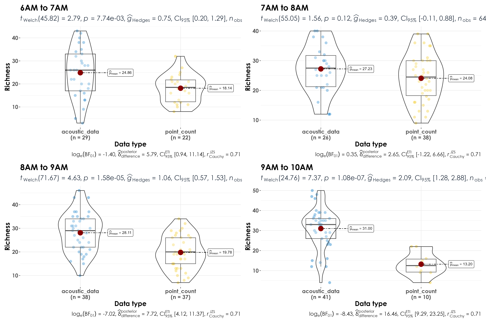

# Time of day analyses  

In this script, we will assess if the time of day (1-hour segments) have an effect on the species richness.  

## Install necessary libraries
```{r}
library(tidyverse)
library(dplyr)
library(stringr)
library(vegan)
library(ggplot2)
library(scico)
library(data.table)
library(extrafont)
library(ggstatsplot)

# Source any custom/other internal functions necessary for analysis
source("code/01_internal-functions.R")
```

## Load dataframe containing point count and acoustic data
```{r}
datSubset <- read.csv("results/datSubset.csv")
```

## Load species trait data
```{r}
trait <- read.csv("data/species-trait-dat.csv")

# add it to the subset data
datSubset <- left_join(datSubset,trait[,c(1,7,8)], by = "scientific_name")
```

## What times of day have been sampled across sites?

Here we get a sense of what times of day have been visited/sampled most across sites for point count data and acoustic surveys
```{r}
nSitesTime_pc <- datSubset%>% 
  filter(data_type == "point_count") %>%
  dplyr::select(site_id, time_of_day)%>%
  distinct() %>% arrange(time_of_day) %>% count(time_of_day)

nSitesTime_aru <- datSubset%>% 
  filter(data_type == "acoustic_data") %>%
  dplyr::select(site_id, time_of_day)%>%
  distinct() %>% arrange(time_of_day) %>% count(time_of_day)

# This comparison lets us know that number of visits for the time_of_day - 9AM to 10AM is significantly different between acoustic data and point counts and we shall ignore this time segment when we carry out further analyses.  
```

## Estimate richness by time of day  

Here we will estimate species richness for different 1-hour segments with the expectation that richness/detections would differ between point counts and acoustic surveys.  
```{r}
# point-count data
# estimate total abundance across all species for each site
abundance <- datSubset %>%
  filter(data_type == "point_count") %>%
  group_by(site_id, scientific_name,
           common_name, eBird_codes, time_of_day) %>% summarise(totAbundance = sum(number)) %>%
  filter(time_of_day != "9AM to 10AM") %>%
  ungroup()

# estimate richness for point count data
pc_richness_time <- abundance %>%
  mutate(forRichness = case_when(totAbundance > 0 ~ 1)) %>%
  group_by(site_id, time_of_day) %>%
  summarise(richness = sum(forRichness)) %>%
  mutate(data_type = "point_count") %>%
  ungroup()

# estimate total number of detections across the acoustic data
# note: we cannot call this abundance as it refers to the total number of vocalizations across a 16-min period across all sites
detections <- datSubset %>%
  filter(data_type == "acoustic_data") %>%
  group_by(site_id, scientific_name,
           common_name, eBird_codes, time_of_day) %>% summarise(totDetections = sum(number)) %>%
  filter(time_of_day != "9AM to 10AM") %>%
  ungroup()

# estimate richness for acoustic data
aru_richness_time <- detections %>%
  mutate(forRichness = case_when(totDetections > 0 ~ 1)) %>%
  group_by(site_id, time_of_day) %>%
  summarise(richness = sum(forRichness)) %>%
  mutate(data_type = "acoustic_data") %>%
  ungroup()
```

## Visualize differences in richness between point count data and acoustic data
```{r}
richness_time <- bind_rows(pc_richness_time, aru_richness_time)

# visualization for different times of day
fig_richness_by_time <- richness_time %>%
  grouped_ggbetweenstats(x = data_type,
                         y = richness,
                         grouping.var = time_of_day,
                         xlab = "Data type",
                         ylab = "Richness", 
                         pairwise.display = "significant",
                         package = "ggsci",
                         palette = "default_jco",
ggplot.component = list(theme(text = element_text(family = "Century Gothic", size = 15, face = "bold"),plot.title = element_text(family = "Century Gothic",
      size = 18, face = "bold"),
      plot.subtitle = element_text(family = "Century Gothic", 
      size = 15, face = "bold",color="#1b2838"),
      axis.title = element_text(family = "Century Gothic",
      size = 15, face = "bold"))))

ggsave(fig_richness_by_time, filename = "figs/fig_richness_by_time.png", width = 13, height = 10, device = png(), units = "in", dpi = 300)
dev.off() 
```


