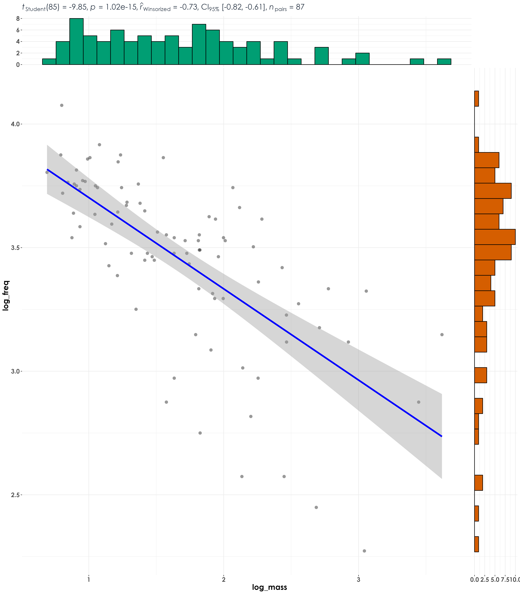

# Body mass - Frequency correlations  

In this script, we test for correlations between body mass and median peak frequency, with the expectation that larger-bodied species vocalize at lower frequencies compared to smaller-bodied species.  

## Load necessary libraries
```{r}
library(tidyverse)
library(dplyr)
library(stringr)
library(vegan)
library(ggplot2)
library(scico)
library(psych)
library(ecodist)
library(RColorBrewer)
library(ggforce)
library(ggalt)
library(patchwork)
library(sjPlot)
library(ggside)
library(ggstatsplot)
library(extrafont)
library(scales)

# Source any custom/other internal functions necessary for analysis
source("code/01_internal-functions.R")
```

## Load species trait data and frequency data
```{r}
trait <- read.csv("data/species-trait-dat.csv")
freq <- read.csv("data/frequency-data.csv")
```

## Process frequency data

We will extract the median peak frequency for each species. Note: For a total of 114 species, template recordings (varying from a minimum of 2 templates to 1910 templates per species) was extracted by Meghana P Srivathsa. While extracting median peak frequency, no distinction was made between songs and calls as our aim is understand which approach detected species more across visits. Note, we removed species that had very few templates (we only kept species that had a minimum of 10 frequency related measures).    
```{r}
# Only a total of 87 species are left after filtering species with very few templates
nTemplates_10 <- freq %>%
  group_by(eBird_codes) %>%
  count() %>%
  filter(n >= 10)

# left-join to remove species with less than 10 templates in the frequency dataset
freq_10 <- left_join(nTemplates_10[,1], freq)

# calculate median peak frequency
median_pf_10 <- freq_10 %>%
  group_by(eBird_codes) %>%
  summarise(median_peak_freq =  median(peak_freq_in_Hz))
```

## Visualization of correlations between body mass and frequency  
```{r}
# join the frequency data to species trait dat
bm_freq <- left_join(median_pf_10, trait, by = "eBird_codes")

# log-transform data
bm_freq$log_mass <- log10(bm_freq$mass)
bm_freq$log_freq <- log10(bm_freq$median_peak_freq)

# visualization
fig_medFreq_bodyMass <- ggscatterstats(
  data = bm_freq,
  x = log_mass,
  y = log_freq,
  type = "r",
  ggplot.component = list(theme(text = element_text(family = "Century Gothic", size = 15, face = "bold"),plot.title = element_text(family = "Century Gothic",
      size = 18, face = "bold"),
      plot.subtitle = element_text(family = "Century Gothic", 
      size = 15, face = "bold",color="#1b2838"),
      axis.title = element_text(family = "Century Gothic",
      size = 15, face = "bold"))))

ggsave(fig_medFreq_bodyMass, filename = "figs/fig_medianPeakFreq_bodyMass_correlations.png", width = 14, height = 16, device = png(), units = "in", dpi = 300)
dev.off() 
```

  
