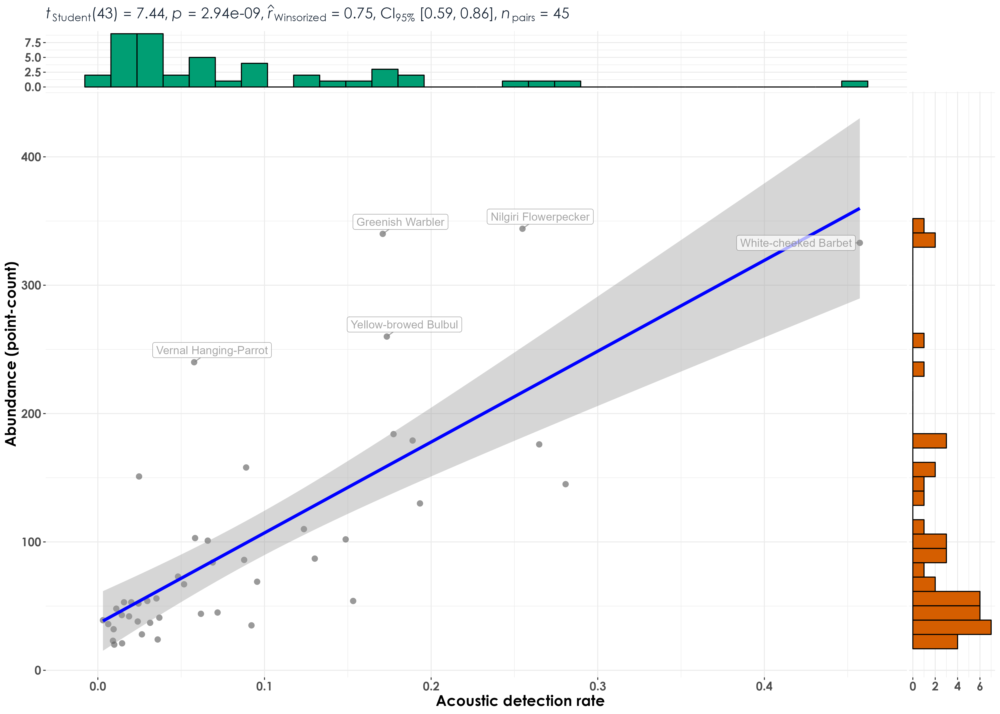

# Abundance vs. acoustic detection rates

In this script, we model correlations and regressions between raw abundance (as estimated via point count data) and acoustic detection rates (calculated from acoustic data).

Here, abundance corresponds to the total number of individuals of a species detected across visits and sites and can only be calculated for point count data.

Here, we will calculate a measure which we define as acoustic detection rate. Acoustic detection rate is calculated as the number of vocalizations/detections in each 10-s audio file over the total number of 10-s audio files analyzed across visits and sites. An example for the same is provided below:

Each site can have around 4 to 6 15-min acoustic surveys. This would mean that the total number of 10-s clips for a site would range from 360 to 540 (15-minutes = 900s = a total of 90 10-s audio files. Across 4 or 6 visits, this number would be 90x4 or 90x6).

Hence, the acoustic detection rate for each species at a site is defined as (x number of vocalizations or acoustic detections)/(total number of 10-s clips analyzed).  

## Install necessary libraries
```{r}
library(tidyverse)
library(dplyr)
library(stringr)
library(vegan)
library(ggplot2)
library(scico)
library(data.table)
library(extrafont)
library(ggstatsplot)
library(ggside)
library(sjPlot)
library(emmeans)
library(scales)
library(glmmTMB)
library(ggeffects)
library(performance)

# function to z-transform data
scale_z <- function(x){
  (x - mean(x, na.rm=TRUE))/sd(x, na.rm=TRUE)
}

# Source any custom/other internal functions necessary for analysis
source("code/01_internal-functions.R")
```

## Load existing data
```{r}
datSubset <- read.csv("results/datSubset.csv")
```

## Estimate abundance from point count data and calculate acoustic detection rates from acoustic data
```{r}
# point-count data
# estimate total abundance of all species for each site across visits
abundance <- datSubset %>%
  filter(data_type == "point_count") %>%
  group_by(site_id, scientific_name,
           common_name, eBird_codes) %>%
  summarise(abundance_pc = sum(number)) %>%
  ungroup()

# for acoustic data, we will first estimate the number of visits to a site, which will essentially translate to the number of 10-s clips that were analyzed/heard (used here as the time period for the calculation of vocalization rates)

# nVisits is calculated here
# except for INBS04U, msot sites had a total of 5 or 6 visits, while INBS04U had 4 visits
nSitesDays <- datSubset %>%
  filter(data_type == "acoustic_data") %>%
  dplyr::select(site_id, date)%>%
  distinct() %>% arrange(site_id) %>% count(site_id) %>%
  rename(nVisits = n)

# estimate total number of detections across the acoustic data
# note: we cannot call this abundance as it refers to the total number of vocalizations across all sites
detections <- datSubset %>%
  filter(data_type == "acoustic_data") %>%
  group_by(site_id, scientific_name,
           common_name, eBird_codes) %>% 
  summarise(detections_aru = sum(number)) %>%
  ungroup()

# estimating acoustic detection rates for each species for each site
aruRate <- detections %>%
  left_join(., nSitesDays, by = "site_id") %>%
  mutate(nClips = nVisits*90) %>%
  mutate(aruRate = detections_aru/nClips)

# Note that the column aruRate can vary between 0 to 1 for each species for each site (this value can vary across sites for each species, referring to how vocally active a species is)
```

## Correlations between acoustic detection rates and abundance from point count data

Here, we correlate abundance from point count data with acoustic detection rates from audio data.
```{r}
# create a single dataframe
data <- full_join(abundance, aruRate)%>%
  replace_na(list(abundance_pc = 0, detections_aru = 0,
                  nVisits = 0, nClips = 0, aruRate = 0))

# previously, we subset species to only include those had a minimum abundance of 20 in point counts. We carry out a similar analysis to only include species that had a minimum of 20 detections in point count data and 20 detections in audio data. 
spp_subset <-  data %>%
  group_by(common_name) %>%
  summarise(abundance_pc = sum(abundance_pc), detections_aru = sum(detections_aru)) %>%
  ungroup() %>%
  filter(abundance_pc >=20 & detections_aru >= 20)

# subset data
# we have 45 species in total
data <- data %>%
  filter(common_name %in% spp_subset$common_name)

## remove rows which have no data in either point count or acoustics
# check with Andrew?
# data <- data %>%
#   filter(abundance_pc != 0) %>%
#   filter(aruRate != 0)

# visualization
fig_abund_aruRate_cor <- ggscatterstats(
  data = data,
  y = abundance_pc,
  x = aruRate,
  type = "r",
  ylab = "Abundance (point-count)",
  xlab = "Acoustic detection rate",
  ggplot.component = list(theme(text = element_text(family = "Century Gothic", size = 15, face = "bold"),plot.title = element_text(family = "Century Gothic",
      size = 18, face = "bold"),
      plot.subtitle = element_text(family = "Century Gothic", 
      size = 15, face = "bold",color="#1b2838"),
      axis.title = element_text(family = "Century Gothic",
      size = 15, face = "bold"))))

# Statistically significant and positive correlations were observed between acoustic detection rates and abundance from point counts when data for all 45 species across sites and visits were pooled

ggsave(fig_abund_aruRate_cor, filename = "figs/fig_aruRate_vs_abundance_correlations.png", width = 14, height = 10, device = png(), units = "in", dpi = 300)
dev.off() 

## grouping data across sites (rerunning correlations at the species-level)
# grouping point count data
species_group <- data %>%
  group_by(scientific_name,
           common_name, eBird_codes) %>% 
  summarise(abundance_pc = sum(abundance_pc),
            aruRate = sum(aruRate)) %>%
  ungroup()

# visualization
fig_abund_aruRate_species <- ggscatterstats(
  data = species_group,
  y = abundance_pc,
  x = aruRate,
  type = "r",
  ylab = "Abundance (point-count)",
  xlab = "Acoustic detection rate",
  label.var = common_name, 
  label.expression = abundance_pc > 200, 
  point.label.args = list(alpha = 0.7, size = 4, color = "grey50"),
  ggplot.component = list(theme(text = element_text(family = "Century Gothic", size = 15, face = "bold"),plot.title = element_text(family = "Century Gothic",
      size = 18, face = "bold"),
      plot.subtitle = element_text(family = "Century Gothic", 
      size = 15, face = "bold",color="#1b2838"),
      axis.title = element_text(family = "Century Gothic",
      size = 15, face = "bold"))))

ggsave(fig_abund_aruRate_species, filename = "figs/fig_aruRate_vs_abundance_correlations_speciesLevel.png", width = 14, height = 10, device = png(), units = "in", dpi = 300)
dev.off() 

```




## Regressions between abundance and acoustic detection rates  

```{r}
data <- setDT(data)

# extract t-value
data[,  t_value := summary(lm(abundance_pc ~ aruRate))$coefficients[6], by = common_name] 

# extract slope
data[,  slope := lm(abundance_pc ~aruRate)%>% coef()%>% nth(2), by = common_name] 

# extract pearson's correlation
data[,  pearson := cor(abundance_pc, aruRate), by = common_name] 

# extract adjusted r squared
data[,  r_sq := summary(lm(abundance_pc ~ aruRate))$adj.r.squared, by = common_name] 

# create a column with the direction of the slope (whether it is positive or negative), which can be referred to later while plotting    
data[, slope_dir := ifelse(slope >0, '+', '-')]
paste("Positive regressions:",length(unique(data$common_name[data$slope_dir %in% c('+')])))
# 39 species had a positive regression or slope value

## visualization
fig_aruRate_abund_reg <- ggplot(data, aes(x = aruRate,
                                              y = abundance_pc)) +
  geom_point(color = "#9CC3D5",size = 1.2) +
  geom_smooth(data = data, aes(group = common_name,
                                     color = slope_dir), 
              method = 'lm', se = FALSE, 
              linewidth = 0.7) +
  scale_color_manual(values=c("#1B9E77", "#D95F02")) +
  labs(x="\nAcoustic detection rate", 
       y="Abundance (from point count data)\n") + 
  theme_bw() +
  annotate("text", y=18, x=0.9, 
           label= "Slope:", col = "grey30", size = 12) + 
  annotate("text", y=16, x=0.9, 
           label= "+", col = "#D95F02", size = 12) + 
  annotate("text", y = 13, x=0.9, 
           label = "-", col = "#1B9E77", size = 12)+
  theme(text = element_text(family = "Century Gothic", size = 18, face = "bold"),plot.title = element_text(family = "Century Gothic",
      size = 18, face = "bold"),
      plot.subtitle = element_text(family = "Century Gothic", 
      size = 15, face = "bold",color="#1b2838"),
      axis.title = element_text(family = "Century Gothic",
      size = 18, face = "bold"),
      legend.position = "none")

ggsave(fig_aruRate_abund_reg, filename = "figs/fig_aruRate_vs_abundance_regressions.png", width = 14, height = 12, device = png(), units = "in", dpi = 300)
dev.off() 

# extract the slope, t_value, pearson correlation and the adjusted r square
lm_output <- data %>%
  dplyr::select(common_name, t_value, slope, pearson, slope_dir,r_sq) %>% distinct()

# write the values to file
write.csv(lm_output, "results/aruRates-abundance-regressions.csv",
          row.names = F)
```


## Plotting species-specific regression plots of abundance and acoustic detection rate

```{r}
# visualization
plots <- list()

for(i in 1:length(unique(data$common_name))){
  
  # extract species common name
  a <- unique(data$common_name)[i]
  
  # subset data for plotting
  for_plot <- data[data$common_name==a,]
  
  # create plots
  plots[[i]] <- ggplot(for_plot, aes(x = aruRate,
                                    y = abundance_pc)) +
  geom_point(color = "#9CC3D5",size = 1.2) +
  geom_smooth(aes(color = "#D95F02"),
    method = 'lm', se = TRUE, 
              linewidth = 0.7) +
    labs(title = paste0(a,"  ","r_sq = ", signif(for_plot$r_sq, digits = 2), "  ", paste0("slope = ",signif(for_plot$slope, digits = 4))),
      x="\nAcoustic detection rates (from acoustic data)", 
       y="Abundance (from point count data)\n") +
    theme_bw() +
  theme(text = element_text(family = "Century Gothic", size = 18, face = "bold"),plot.title = element_text(family = "Century Gothic",
      size = 18, face = "bold"),
      plot.subtitle = element_text(family = "Century Gothic", 
      size = 15, face = "bold",color="#1b2838"),
      axis.title = element_text(family = "Century Gothic",
      size = 18, face = "bold"),
      legend.position = "none")
}

# plot and save as a single pdf
cairo_pdf(
  filename = "figs/aruRate-abundance-by-species-regressions.pdf",
  width = 13, height = 12,
  onefile = TRUE
)
plots
dev.off() 
```


## Association between abundance and acoustic detection rates across species

Here, we run a generalized linear mixed effects model to test for associations between abundance and acoustic detection rates.
```{r}
## all birds model
m1 <- glmmTMB(abundance_pc ~ aruRate +
                (1|common_name) + (1|site_id),
              family=gaussian(),
               data = data)

summary(m1)
plot_model(m1, type = "re")
plot(ggpredict(m1))

r2(m1)
```


