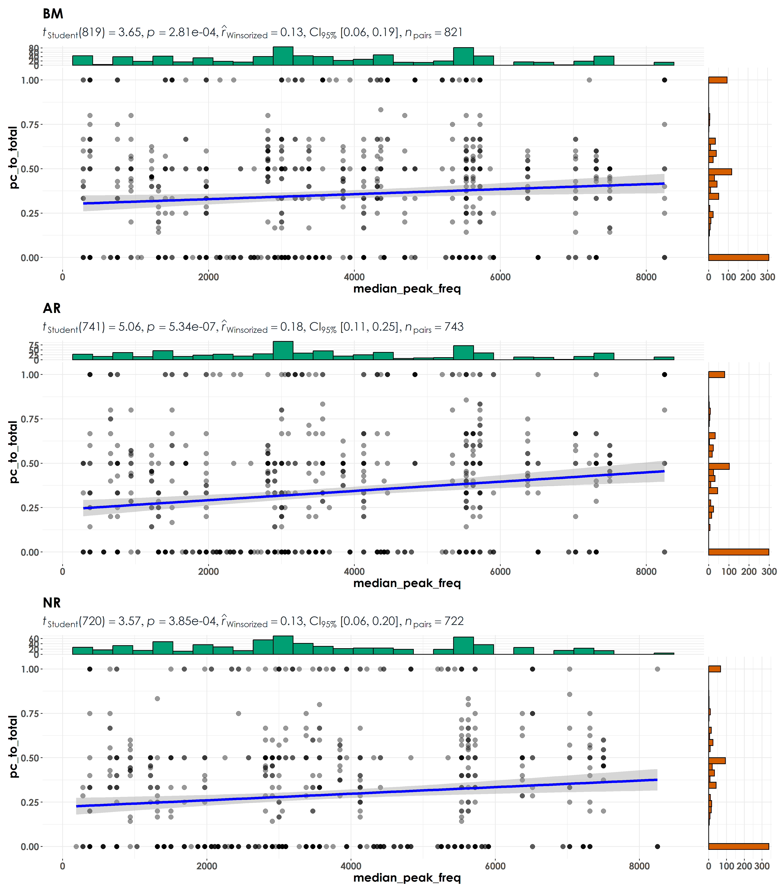
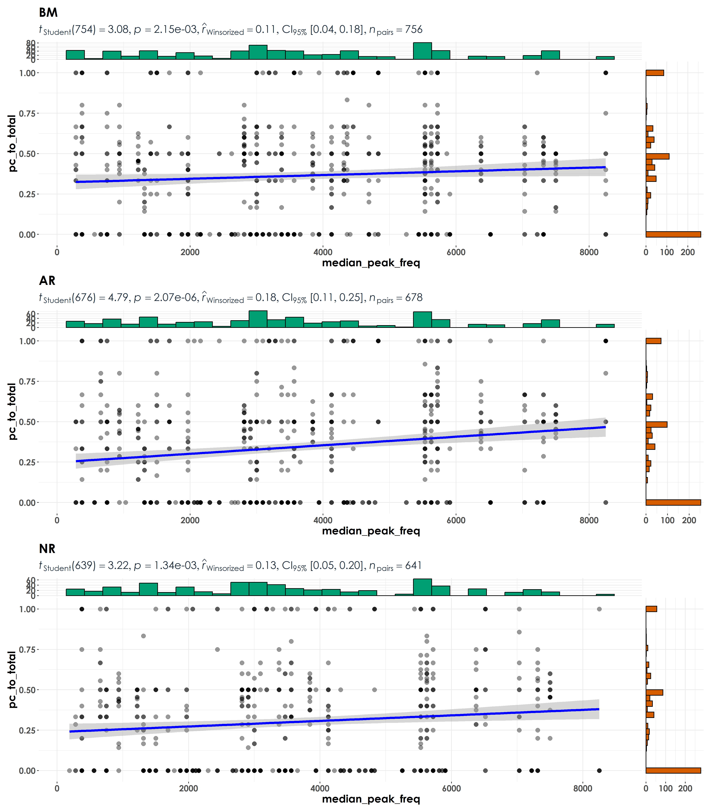
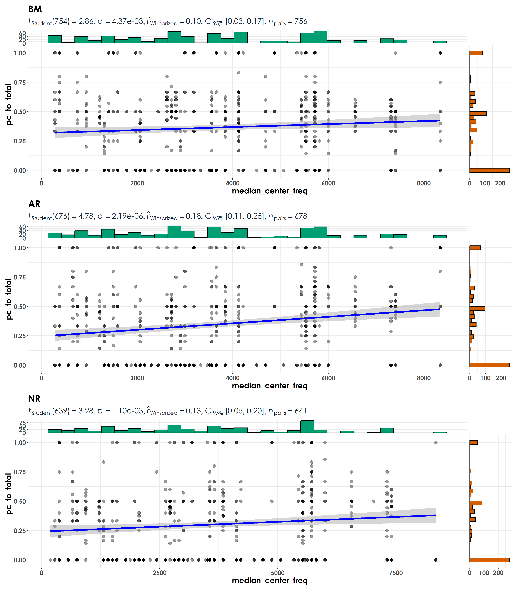

# Frequency  

In this script, we will explore relationships between the ratio of bird detections in a point count and acoustic survey and the median peak frequecy of a species. To do this, we will continue to rely on detections estimated at the site-level (similar to what was required for the indicator species analysis).   

To get at this measure, we estimate detections at the site level (for a total of six visits). If the across_visit_detections = 6, that means that a species was detected every single time across each of the six visits to that site. This value ranges from 1 to 6 for each species for a point count survey while ranging between 1 to 5 for each species for an acoustic survey. To account for the slight difference in the number of visits, we scale the data to go between 1 and 10 (arbitrarily chosen) to ensure that the visit-level estimates are comparable.  

## Load necessary libraries
```{r}
library(tidyverse)
library(dplyr)
library(stringr)
library(vegan)
library(ggplot2)
library(scico)
library(psych)
library(ecodist)
library(RColorBrewer)
library(ggforce)
library(ggalt)
library(patchwork)
library(sjPlot)
library(ggside)
library(ggstatsplot)
library(extrafont)
library(scales)

# Source any custom/other internal functions necessary for analysis
source("code/01_internal-functions.R")
```

## Load dataframe containing point count and acoustic data
```{r}
datSubset <- read.csv("results/datSubset.csv")
```

## Load species trait data and frequency data
```{r}
trait <- read.csv("data/species-trait-dat.csv")
freq <- read.csv("data/frequency-data.csv")
```

## Process frequency data  

We will extract the median peak frequency for each species. Note: For a total of 114 species, template recordings (varying from a minimum of 2 templates to 1910 templates per species) was extracted by Meghana P Srivathsa. While extracting median peak frequency, no distinction was made between songs and calls as our aim is understand which approach detected species more across visits.  
```{r}
# how many templates exist across species
# minimum templates = 2; maximum templates = 1910
nTemplates <- freq %>%
  group_by(eBird_codes) %>%
  count()

median_pf <- freq %>%
  group_by(eBird_codes) %>%
  summarise(median_peak_freq =  median(peak_freq_in_Hz))
```

## Visit-level detection estimates for each species  

We estimate the total number of detections of each species across all visits for point count data and acoustic surveys and scale them so that they are comparable.    
```{r}
## we will estimate abundance across point counts by site-date (essentially corresponding to visit)
abundance <- datSubset %>%
  filter(data_type == "point_count") %>%
  group_by(date, site_id, restoration_type, scientific_name,
           common_name, eBird_codes) %>% 
  summarise(totAbundance = sum(number)) %>%
  ungroup()

# estimate across visit detections for point count data
pc_visit_detections <- abundance %>%
  mutate(forDetections = case_when(totAbundance > 0 ~ 1)) %>%
  group_by(scientific_name, site_id,restoration_type) %>%
  summarise(pc_visit_detections = sum(forDetections)) %>%
  mutate(data_type = "point_count") %>%
  ungroup()

# scale values to go between 1 and 10
pc_visit_detections$pc_visit_scaled <- rescale(pc_visit_detections$pc_visit_detections, to = c(1,10))

# estimate total number of detections across the acoustic data by site-date (essentially corresponds to a visit)
# note: we cannot call this abundance as it refers to the total number of vocalizations across a 16-min period across all sites
detections <- datSubset %>%
  filter(data_type == "acoustic_data") %>%
  group_by(date, site_id, restoration_type, scientific_name,
           common_name, eBird_codes) %>% 
  summarise(totDetections = sum(number)) %>%
  ungroup()

# estimate across visit detections for acoustic data
aru_visit_detections <- detections %>%
  mutate(forDetections = case_when(totDetections > 0 ~ 1)) %>%
  group_by(scientific_name, site_id,restoration_type) %>%
  summarise(aru_visit_detections = sum(forDetections)) %>%
  mutate(data_type = "acoustic_data") %>%
  ungroup()

# scale values to go between 1 and 10
aru_visit_detections$aru_visit_scaled <- rescale(aru_visit_detections$aru_visit_detections, to = c(1,10))
```

## Exploring ratios of detections in point counts & acoustic surveys to median peak frequency of a species  
```{r}
# create a single dataframe
visit_detections <- full_join(pc_visit_detections[,-5], aru_visit_detections[,-5]) %>%
  replace_na(list(pc_visit_detections = 0, aru_visit_detections = 0,
                  pc_visit_scaled = 0, aru_visit_scaled = 0))
  
# create column of ratio of detections of point counts to total number of detections from point count and acoustic data
# note: if there are no detections through the acoustic survey, the ratio will be 1; if there are equal number of detections in the acoustic survey and point count data, the ratio will be 0.5; if there no detections/lesser detections in a point count compared to acoustic survey, the ratio will be between 0 and 0.5; and lastly, if there are more detections in a point count compared to an acoustic survey, the ratio will be between 0.5 and 1. 

visit_detections <- visit_detections %>%
  mutate(pc_to_total = (pc_visit_scaled)/
           (pc_visit_scaled + aru_visit_scaled))

# join the frequency data to species trait dat
dat_median <- left_join(median_pf, trait, by = "eBird_codes")

# join the above dataframe to the detections dataset
visit_detections <- left_join(dat_median[,c(1:3)],
                              visit_detections,
                   by = "scientific_name")

# reordering factors for plotting
visit_detections$restoration_type <- factor(visit_detections$restoration_type, levels = c("BM", "AR", "NR"))
  
# removing outliers prior to visualization
visit_detections <- visit_detections %>%
  filter(eBird_codes != "PBFL") # Pale-billed flowerpecker

# visualization
fig_medFreq <- grouped_ggscatterstats(
  data = visit_detections,
  x = median_peak_freq,
  y = pc_to_total,
  grouping.var = restoration_type,
  type = "r",
  plotgrid.args = list(nrow = 3, ncol = 1),
  ggplot.component = list(theme(text = element_text(family = "Century Gothic", size = 15, face = "bold"),plot.title = element_text(family = "Century Gothic",
      size = 18, face = "bold"),
      plot.subtitle = element_text(family = "Century Gothic", 
      size = 15, face = "bold",color="#1b2838"),
      axis.title = element_text(family = "Century Gothic",
      size = 15, face = "bold"))))

ggsave(fig_medFreq, filename = "figs/fig_medianPeakFreq_detectionRatio.png", width = 14, height = 16, device = png(), units = "in", dpi = 300)
dev.off() 
```

  
  
## Rerun analyses by including only species with a minimum of 10 templates    
```{r}
# Only a total of 87 species are left after filtering species with very few templates
nTemplates_10 <- freq %>%
  group_by(eBird_codes) %>%
  count() %>%
  filter(n >= 10)

# left-join to remove species with less than 10 templates in the frequency dataset
freq_10 <- left_join(nTemplates_10[,1], freq)

# calculate median peak frequency
median_pf_10 <- freq_10 %>%
  group_by(eBird_codes) %>%
  summarise(median_peak_freq =  median(peak_freq_in_Hz))

# create a single dataframe for visit_detections
visit_detections <- full_join(pc_visit_detections[,-5], aru_visit_detections[,-5]) %>%
  replace_na(list(pc_visit_detections = 0, aru_visit_detections = 0,
                  pc_visit_scaled = 0, aru_visit_scaled = 0))

visit_detections <- visit_detections %>%
  mutate(pc_to_total = (pc_visit_scaled)/
           (pc_visit_scaled + aru_visit_scaled))

# join this dataframe to species trait dat
dat_median_10 <- left_join(median_pf_10, trait, by = "eBird_codes")

# join the above dataframe to the detections dataset
visit_detections <- left_join(dat_median_10[,c(1:3)],
                              visit_detections,
                   by = "scientific_name")

# reordering factors for plotting
visit_detections$restoration_type <- factor(visit_detections$restoration_type, levels = c("BM", "AR", "NR"))
  
# removing outliers prior to visualization
visit_detections <- visit_detections %>%
  filter(eBird_codes != "PBFL") # Pale-billed flowerpecker

# visualization
fig_medFreq_10 <- grouped_ggscatterstats(
  data = visit_detections,
  x = median_peak_freq,
  y = pc_to_total,
  grouping.var = restoration_type,
  type = "r",
  plotgrid.args = list(nrow = 3, ncol = 1),
  ggplot.component = list(theme(text = element_text(family = "Century Gothic", size = 15, face = "bold"),plot.title = element_text(family = "Century Gothic",
      size = 18, face = "bold"),
      plot.subtitle = element_text(family = "Century Gothic", 
      size = 15, face = "bold",color="#1b2838"),
      axis.title = element_text(family = "Century Gothic",
      size = 15, face = "bold"))))

ggsave(fig_medFreq_10, filename = "figs/fig_medianPeakFreq_min10templates_detectionRatio.png", width = 14, height = 16, device = png(), units = "in", dpi = 300)
dev.off() 
```

    
  
## Exploring center frequency instead of peak frequency

```{r}
# calculate median center frequency with the list of species that have a minimum of 10 templates
median_cf_10 <- freq_10 %>%
  group_by(eBird_codes) %>%
  summarise(median_center_freq =  median(center_freq_in_Hz))

# create a single dataframe for visit_detections
visit_detections <- full_join(pc_visit_detections[,-5], aru_visit_detections[,-5]) %>%
  replace_na(list(pc_visit_detections = 0, aru_visit_detections = 0,
                  pc_visit_scaled = 0, aru_visit_scaled = 0))

visit_detections <- visit_detections %>%
  mutate(pc_to_total = (pc_visit_scaled)/
           (pc_visit_scaled + aru_visit_scaled))

# join this dataframe to species trait dat
dat_median_cf_10 <- left_join(median_cf_10, trait, by = "eBird_codes")

# join the above dataframe to the detections dataset
visit_detections <- left_join(dat_median_cf_10[,c(1:3)],
                              visit_detections,
                   by = "scientific_name")

# reordering factors for plotting
visit_detections$restoration_type <- factor(visit_detections$restoration_type, levels = c("BM", "AR", "NR"))
  
# removing outliers prior to visualization
visit_detections <- visit_detections %>%
  filter(eBird_codes != "PBFL") # Pale-billed flowerpecker

# visualization
fig_medCenterFreq_10 <- grouped_ggscatterstats(
  data = visit_detections,
  x = median_center_freq,
  y = pc_to_total,
  grouping.var = restoration_type,
  type = "r",
  plotgrid.args = list(nrow = 3, ncol = 1),
  ggplot.component = list(theme(text = element_text(family = "Century Gothic", size = 15, face = "bold"),plot.title = element_text(family = "Century Gothic",
      size = 18, face = "bold"),
      plot.subtitle = element_text(family = "Century Gothic", 
      size = 15, face = "bold",color="#1b2838"),
      axis.title = element_text(family = "Century Gothic",
      size = 15, face = "bold"))))

ggsave(fig_medCenterFreq_10, filename = "figs/fig_medianCenterFreq_min10templates_detectionRatio.png", width = 14, height = 16, device = png(), units = "in", dpi = 300)
dev.off() 
```

   
