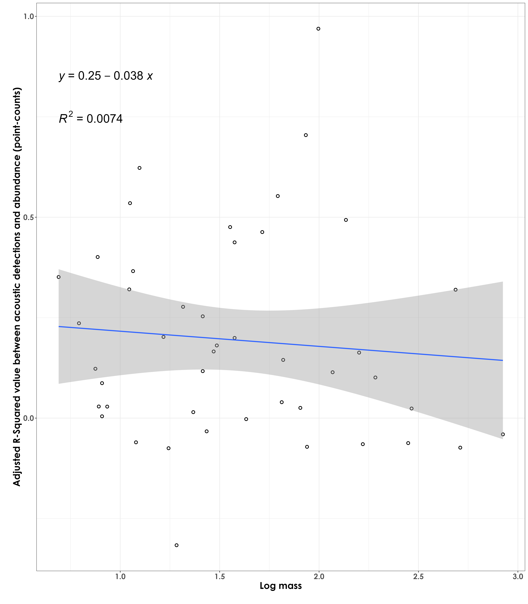
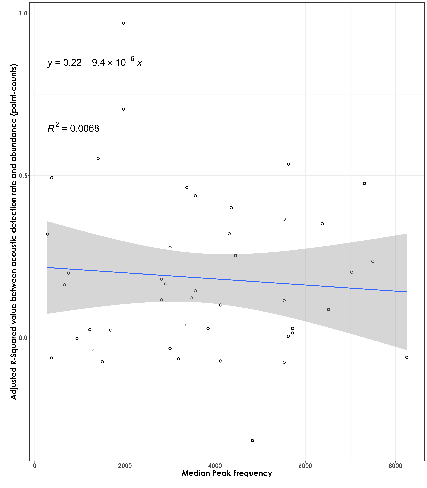

# r sq vs. species traits and calling rates  

In this script, we will plot the adjusted r squared values (derived from the regressions analysis) against species-specific traits.  

## Load necessary libraries
```{r}
library(tidyverse)
library(dplyr)
library(stringr)
library(vegan)
library(ggplot2)
library(scico)
library(psych)
library(ecodist)
library(RColorBrewer)
library(ggforce)
library(ggpubr)
library(ggalt)
library(patchwork)
library(sjPlot)
library(ggside)
library(ggstatsplot)
library(extrafont)
library(ggrepel)

# Source any custom/other internal functions necessary for analysis
source("code/01_internal-functions.R")
```

## Load species trait data and frequency data
```{r}
trait <- read.csv("data/species-trait-dat.csv")
freq <- read.csv("data/frequency-data.csv")
sociality <- read.csv("data/sociality-data.csv")
```

## Load dataframe containing point count and acoustic data
```{r}
datSubset <- read.csv("results/datSubset.csv")
```

## Load adjusted r squared values from previous script  
```{r}
r_sq <- read.csv("results/aruRates-abundance-regressions.csv")
```

## Body mass and R squared values 

Are species of a certain body mass showing stronger/poorer R squared values (between abundance and acoustic detections)?
```{r}
r_sq_trait <- left_join(r_sq, trait, by = "common_name")

# log transform body mass
r_sq_trait$log_mass <- log10(r_sq_trait$mass)

# visualization
fig_bodyMass_rSqValue <- ggplot(r_sq_trait, aes(x=log_mass,y=r_sq)) +  geom_point(shape = 21, colour = "black", fill = "white", size = 2, stroke = 1)+ 
  geom_smooth(method="lm", se=TRUE, fullrange=FALSE, level=0.95,linetype="solid") +  
  theme_bw() +
  stat_regline_equation(label.y = 0.85, aes(label = ..eq.label..),
                        size = 8) +
  stat_regline_equation(label.y = 0.75, aes(label = ..rr.label..),
                        size = 8) +
  labs(y="\nAdjusted R-Squared value between acoustic detection rate and abundance (point-counts)", 
       x="Log mass\n") +
  theme(text = element_text(family = "Century Gothic", size = 18, face = "bold"),plot.title = element_text(family = "Century Gothic",
      size = 18, face = "bold"),
      plot.subtitle = element_text(family = "Century Gothic", 
      size = 15, face = "bold",color="#1b2838"),
      axis.title = element_text(family = "Century Gothic",
      size = 18, face = "bold"))

ggsave(fig_bodyMass_rSqValue, filename = "figs/fig_bodyMass_adjustedrSq.png", width = 14, height = 16, device = png(), units = "in", dpi = 300)
dev.off() 
```

  

## Median peak frequency and R squared values  

```{r}
# Only a total of 87 species are left after filtering species with very few templates
nTemplates_10 <- freq %>%
  group_by(eBird_codes) %>%
  count() %>%
  filter(n >= 10)

# left-join to remove species with less than 10 templates in the frequency dataset
freq_10 <- left_join(nTemplates_10[,1], freq)

# calculate median peak frequency
median_pf <- freq_10 %>%
  group_by(eBird_codes) %>%
  summarise(median_peak_freq =  median(peak_freq_in_Hz))

# add scientific_name to median_pf
median_pf <- left_join(median_pf, trait[,c(1,2,4)], by = "eBird_codes")

# join r sq and median pf dataframes
r_sq_freq <- left_join(r_sq, median_pf, by = "common_name")

# visualization
fig_medianPeakFreq_rSqValue <- ggplot(r_sq_freq, aes(x=median_peak_freq,y=r_sq)) +  geom_point(shape = 21, colour = "black", fill = "white", size = 2, stroke = 1)+ 
  geom_smooth(method="lm", se=TRUE, fullrange=FALSE, level=0.95,linetype="solid") +  
  theme_bw() +
  stat_regline_equation(label.y = 0.85, aes(label = ..eq.label..),
                        size = 8) +
  stat_regline_equation(label.y = 0.65, aes(label = ..rr.label..),
                        size = 8) +
  labs(y="\nAdjusted R-Squared value between acoustic detection rate and abundance (point-counts)", 
       x="Median Peak Frequency\n") +
  theme(text = element_text(family = "Century Gothic", size = 18, face = "bold"),plot.title = element_text(family = "Century Gothic",
      size = 18, face = "bold"),
      plot.subtitle = element_text(family = "Century Gothic", 
      size = 15, face = "bold",color="#1b2838"),
      axis.title = element_text(family = "Century Gothic",
      size = 18, face = "bold"))

ggsave(fig_medianPeakFreq_rSqValue, filename = "figs/fig_medianPeakFrequency_adjustedrSq.png", width = 14, height = 16, device = png(), units = "in", dpi = 300)
dev.off() 
```

  

## Median peak amplitude and R squared values

```{r}
# calculate median peak amplitude
# we extract only the median of the 95th percentile of values
median_amp <- freq_10 %>%
  group_by(eBird_codes) %>%
  filter(peak_amp >= quantile(peak_amp, 0.95, na.rm = T)) %>%
  summarise(median_peak_amp = median(peak_amp))

# add scientific_name to median_amp
median_amp <- left_join(median_amp, trait[,c(1,2,4)], by = "eBird_codes")
median_amp$log_median_peak_amp <- log10(median_amp$median_peak_amp)

# join r sq and median amplitude dataframes
r_sq_amp <- left_join(r_sq, median_amp, by = "common_name")

# visualization
fig_medianPeakAmplitude_rSqValue <- ggplot(r_sq_amp, aes(x=log_median_peak_amp,y=r_sq)) +  geom_point(shape = 21, colour = "black", fill = "white", size = 2, stroke = 1)+ 
  geom_smooth(method="lm", se=TRUE, fullrange=FALSE, level=0.95,linetype="solid") +  
  theme_bw() +
  stat_regline_equation(label.y = 0.85, aes(label = ..eq.label..),
                        size = 8) +
  stat_regline_equation(label.y = 0.65, aes(label = ..rr.label..),
                        size = 8) +
  labs(y="\nAdjusted R-Squared value between acoustic detection rate and abundance (point-counts)", 
       x="log(Median Peak Amplitude)\n") +
  theme(text = element_text(family = "Century Gothic", size = 18, face = "bold"),plot.title = element_text(family = "Century Gothic",
      size = 18, face = "bold"),
      plot.subtitle = element_text(family = "Century Gothic", 
      size = 15, face = "bold",color="#1b2838"),
      axis.title = element_text(family = "Century Gothic",
      size = 18, face = "bold"))

ggsave(fig_medianPeakAmplitude_rSqValue, filename = "figs/fig_medianPeakAmplitude_adjustedrSq.png", width = 14, height = 16, device = png(), units = "in", dpi = 300)
dev.off() 
```

  

## Calling rate and R squared values  

How does the coefficient of determination (tightness of fit between acoustic detection rate and abundance from point count data) compare to the calling rate? Here, calling rate for each species is defined as the total acoustic detections divided by the total number of individuals (from point counts). We aim to ask if species that have higher calling rate per individual have a stronger relationship between acoustics and point count data.

```{r}
# point-count data
# estimate total abundance across all species for each site
abundance <- datSubset %>%
  filter(data_type == "point_count") %>%
  group_by(site_id, scientific_name,
           common_name, eBird_codes) %>% 
  summarise(abundance_pc = sum(number)) %>%
  ungroup()

# estimate total number of detections across the acoustic data
# note: we cannot call this abundance as it refers to the total number of vocalizations across all sites
detections <- datSubset %>%
  filter(data_type == "acoustic_data") %>%
  group_by(site_id, scientific_name,
           common_name, eBird_codes) %>% 
  summarise(detections_aru = sum(number)) %>%
  ungroup()

# create a single dataframe
data <- full_join(abundance, detections)%>%
  replace_na(list(abundance_pc = 0, detections_aru = 0)) 

# identifying species that need to be kept
# only those species that have a minimum abundance value of 10 and minimum detection value of 10
spp_subset <-  data %>%
  group_by(common_name) %>%
  summarise(abundance_pc = sum(abundance_pc), detections_aru = sum(detections_aru)) %>%
  ungroup() %>%
  filter(abundance_pc >=20)

# subset data
dat_subset <- data %>%
  filter(common_name %in% spp_subset$common_name) 

# summarizing data (to join with the dataframe on R sq values)
dat_subset <- dat_subset %>%
  group_by(scientific_name, common_name, eBird_codes) %>%
  summarise(abundance_pc = sum(abundance_pc), detections_aru = sum(detections_aru)) %>%
  ungroup()

# join with r squared dataframe
r_sq_callingRate <- left_join(r_sq, dat_subset, by = "common_name")

# extract calling rate
r_sq_callingRate$calling_rate <- r_sq_callingRate$detections_aru/r_sq_callingRate$abundance_pc

## visualization
fig_calling_rate_rSq <- ggplot(r_sq_callingRate, aes(x=calling_rate,y=r_sq)) +  geom_point(shape = 21, colour = "black", fill = "white", size = 2, stroke = 1)+ 
  geom_smooth(method="lm", se=TRUE, fullrange=FALSE, level=0.95,linetype="solid") +  
  theme_bw() +
  stat_regline_equation(label.y = 0.85, aes(label = ..eq.label..),
                        size = 6, family = "Century Gothic") +
  stat_regline_equation(label.y = 0.75, aes(label = ..rr.label..),
                        size = 6, family = "Century Gothic") +
  labs(y="\nAdjusted R-Squared value between acoustic detection rate and abundance (point-counts)", 
       x="Calling rate\n") +
  geom_text_repel(aes(label = scientific_name),family = "Century Gothic", fontface = "italic")+
  theme(text = element_text(family = "Century Gothic", size = 18, face = "bold"),plot.title = element_text(family = "Century Gothic",size = 18, face = "bold"),
      plot.subtitle = element_text(family = "Century Gothic", 
      size = 15, face = "bold",color="#1b2838"),
      axis.title = element_text(family = "Century Gothic",
      size = 18, face = "bold"))

ggsave(fig_calling_rate_rSq, filename = "figs/fig_callingRate_adjustedrSq.png", width = 14, height = 16, device = png(), units = "in", dpi = 300)
dev.off() 
```

 

