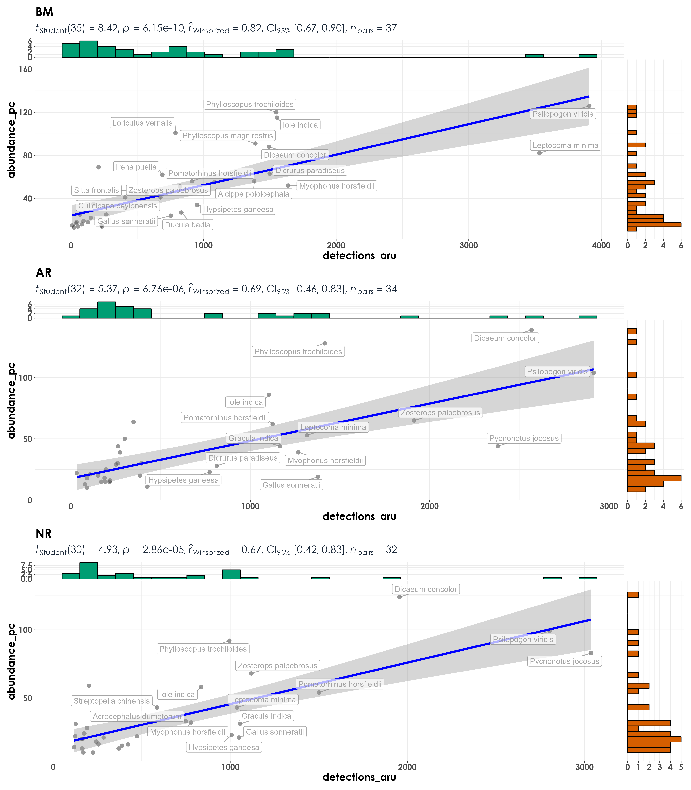
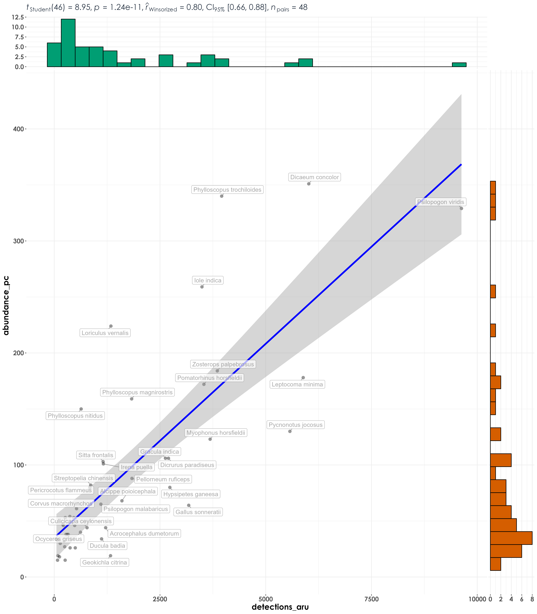

# Abundance vs. detections  

In this script, we test for correlations between abundance (as estimated from point count data) and detections (as estimated from acoustic data).  

## Install necessary libraries
```{r}
library(tidyverse)
library(dplyr)
library(stringr)
library(vegan)
library(ggplot2)
library(scico)
library(data.table)
library(extrafont)
library(ggstatsplot)
library(ggside)
library(lme4)
library(report)

# Source any custom/other internal functions necessary for analysis
source("code/01_internal-functions.R")
```

## Load dataframe containing point count and acoustic data
```{r}
datSubset <- read.csv("results/datSubset.csv")
```

## Estimate abundance for point count data and detections for acoustic data    
Here, we make a distinction before running correlative analyses that abundance corresponds to the total number of individuals of a species detected across visits to a site and can only be calculated for point count data. In the acoustic dataset, individuals are not seen and a measure of detections (estimated as the total number of times as species was heard across ~576 10-s clips). Here 576 clips correspond to the total amount of acoustic data - 96 min (576 10-s clips) of data = 16-min of data for every visit).  
```{r}
# point-count data
# estimate total abundance across all species for each site
abundance <- datSubset %>%
  filter(data_type == "point_count") %>%
  group_by(site_id, restoration_type, scientific_name,
           common_name, eBird_codes) %>% 
  summarise(abundance_pc = sum(number)) %>%
  ungroup()

# estimate total number of detections across the acoustic data
# note: we cannot call this abundance as it refers to the total number of vocalizations across all sites
detections <- datSubset %>%
  filter(data_type == "acoustic_data") %>%
  group_by(site_id, restoration_type, scientific_name,
           common_name, eBird_codes) %>% 
  summarise(detections_aru = sum(number)) %>%
  ungroup()
```

## Correlations between abundance and detections
```{r}
# create a single dataframe
data <- full_join(abundance, detections)%>%
  replace_na(list(abundance_pc = 0, detections_aru = 0)) 

# reordering factors for plotting
data$restoration_type <- factor(data$restoration_type, levels = c("BM", "AR", "NR"))

# visualization
fig_abund_detec <- grouped_ggscatterstats(
  data = data,
  x = detections_aru,
  y = abundance_pc,
  grouping.var = restoration_type,
  type = "r",
  plotgrid.args = list(nrow = 3, ncol = 1),
  ggplot.component = list(theme(text = element_text(family = "Century Gothic", size = 15, face = "bold"),plot.title = element_text(family = "Century Gothic",
      size = 18, face = "bold"),
      plot.subtitle = element_text(family = "Century Gothic", 
      size = 15, face = "bold",color="#1b2838"),
      axis.title = element_text(family = "Century Gothic",
      size = 15, face = "bold"))))

ggsave(fig_abund_detec, filename = "figs/fig_abundance_vs_detections.png", width = 14, height = 16, device = png(), units = "in", dpi = 300)
dev.off() 
```

  

## Combine site-level data to test for correlations between abundance and detections for each species (at the level of the treatment type)  

Here, each dot in the visualization refers to a particular species and the only difference between this analysis and previous one is that the site-level variation is compressed/lost and the visualization/correlative analyses are being carried out across species and treatment types.  
```{r}
# grouping point count data at the level of the treatment type
abundance_group <- data %>%
  group_by(restoration_type, scientific_name,
           common_name, eBird_codes) %>% 
  summarise(abundance_pc = sum(abundance_pc)) %>%
  ungroup()

# grouping acoustic data at the level of the treatment type
detections_group <- data %>%
  group_by(restoration_type, scientific_name,
           common_name, eBird_codes) %>% 
  summarise(detections_aru = sum(detections_aru)) %>%
  ungroup()

# create a single dataframe
# subset data to get a minimum abundance of ten and a minimum number of acoustic detections of ten
data_group <- full_join(abundance_group, detections_group) %>%
  filter(abundance_pc >=10 & detections_aru >= 10)

# reordering factors for plotting
data_group$restoration_type <- factor(data_group$restoration_type, levels = c("BM", "AR", "NR"))

# visualization
fig_abund_detec_group <- grouped_ggscatterstats(
  data = data_group,
  x = detections_aru,
  y = abundance_pc,
  grouping.var = restoration_type,
  type = "r",
  label.var = scientific_name, 
  label.expression = detections_aru > 500, 
  point.label.args = list(alpha = 0.7, size = 4, color = "grey50"),
  plotgrid.args = list(nrow = 3, ncol = 1),
  ggplot.component = list(theme(text = element_text(family = "Century Gothic", size = 15, face = "bold"),plot.title = element_text(family = "Century Gothic",
      size = 18, face = "bold"),
      plot.subtitle = element_text(family = "Century Gothic", 
      size = 15, face = "bold",color="#1b2838"),
      axis.title = element_text(family = "Century Gothic",
      size = 15, face = "bold"))))

ggsave(fig_abund_detec_group, filename = "figs/fig_abundance_vs_detections_treatmentLevel.png", width = 14, height = 16, device = png(), units = "in", dpi = 300)
dev.off() 
```

   
## Rerun analysis at the level of each species (across all sites and treatments combined)  

Essentially a single graph that plots all the data.  
```{r}
# grouping point count data
abundance_group <- data %>%
  group_by(scientific_name,
           common_name, eBird_codes) %>% 
  summarise(abundance_pc = sum(abundance_pc)) %>%
  ungroup()

# grouping acoustic data at the level of the treatment type
detections_group <- data %>%
  group_by(scientific_name,
           common_name, eBird_codes) %>% 
  summarise(detections_aru = sum(detections_aru)) %>%
  ungroup()

# create a single dataframe
# subset data to get a minimum abundance of ten and a minimum number of acoustic detections of ten
data_group <- full_join(abundance_group, detections_group) %>%
  filter(abundance_pc >=10 & detections_aru >= 10)

# visualization
fig_abund_detec_community <- ggscatterstats(
  data = data_group,
  x = detections_aru,
  y = abundance_pc,
  type = "r",
  label.var = scientific_name, 
  label.expression = detections_aru > 500, 
  point.label.args = list(alpha = 0.7, size = 4, color = "grey50"),
  plotgrid.args = list(nrow = 3, ncol = 1),
  ggplot.component = list(theme(text = element_text(family = "Century Gothic", size = 15, face = "bold"),plot.title = element_text(family = "Century Gothic",
      size = 18, face = "bold"),
      plot.subtitle = element_text(family = "Century Gothic", 
      size = 15, face = "bold",color="#1b2838"),
      axis.title = element_text(family = "Century Gothic",
      size = 15, face = "bold"))))

ggsave(fig_abund_detec_community, filename = "figs/fig_abundance_vs_detections_communityLevel.png", width = 14, height = 16, device = png(), units = "in", dpi = 300)
dev.off() 
```

 

## Species-specific plots of correlations between abundance and detections  
For this analysis, we will not be grouping data by treatment types for plot as we have insufficient data if we divided it up. In addition, we will remove species that were detected in only or the other method (point count or acoustic surveys). Further, we only keep species that had a minimum abundance of 10 and a minimum number of acoustic detections of 10.     
```{r}
# identifying species that need to be kept
# only those species that have a minimum abundance value of 10 and minimum detection value of 10
spp_subset <-  data %>%
  group_by(scientific_name) %>%
  summarise(abundance_pc = sum(abundance_pc), detections_aru = sum(detections_aru)) %>%
  ungroup() %>%
  filter(abundance_pc >=10 & detections_aru >= 10)

# subset data
dat_subset <- data %>%
  filter(scientific_name %in% spp_subset$scientific_name)

# visualization
plots <- list()
metadata <- data.frame()

for(i in 1:length(unique(dat_subset$scientific_name))){
  
  # extract species scientific name
  a <- unique(dat_subset$scientific_name)[i]
  
  # subset data for plotting
  for_plot <- dat_subset[dat_subset$scientific_name==a,]
  
  # create plots
  plots[[i]] <- ggscatterstats(
  data = for_plot,
  x = detections_aru,
  y = abundance_pc,
  type = "r",
  title = a,
  ggplot.component = list(theme(text = element_text(family = "Century Gothic", size = 15, face = "bold"),plot.title = element_text(family = "Century Gothic",size = 18, face = "bold"),
    plot.subtitle = element_text(family = "Century Gothic", 
      size = 15, face = "bold",color="#1b2838"),
      axis.title = element_text(family = "Century Gothic",
      size = 15, face = "bold"))))
  
  # write the metadata to a dataframe for later analysis
  # extracting information using a pre-existing function
  stat <- extract_stats(plots[[i]])$subtitle_data
  stat$scientific_name <- a
  
  # add it to the above empty metadata dataframe
  metadata <- rbind(metadata, stat)
}

# plot and save as a single pdf
cairo_pdf(
  filename = "figs/abundance-detections-by-species.pdf",
  width = 13, height = 12,
  onefile = TRUE
)
plots
dev.off()

# write the metadata to a .csv
write.csv(metadata[,-14], # removing the expression column
          "results/correlationScores-abundance-detections.csv",
          row.names = F)
```

Rerunning the abundance-detection analysis essentially suggests that at the community level/when species are pooled across sites - there seems to be a high Pearson’s correlation value between abundance and detections (when site-level variation is include, this ranges between 0.51 to 0.55, but when site-level variation is compressed/lost/pooled across treatments, this value ranges between 0.85 to 0.87).  

However, when we break this result down and examine it for each species by species, we notice that the above result varies by species. At the species level, we considered a total of 48 species for this exercise. The list of 48 species only includes those that had a minimum abundance value of 10 and a minimum number of acoustic detections of 10.   

We observed that ~15 species showed a positive r of >0.4, ~20 species showed a positive r of >0.3.Nine species showed a very small positive r value between 0 and 0.2. The species that showed the highest positive r values include Pycnonotus jocosus (0.85), Hypsipetes ganeesa (0.67) and Leptocoma minima (0.66).     

Five species had a negative r value between 0 and -0.2. Seven species had a negative r value that ranged between -0.2 and -0.51. The three species showing a very high negative r value are Dicrurus aeneus (-0.51), Muscicapa muttui(-0.46), and Ficedula ruficauda (-0.45).  