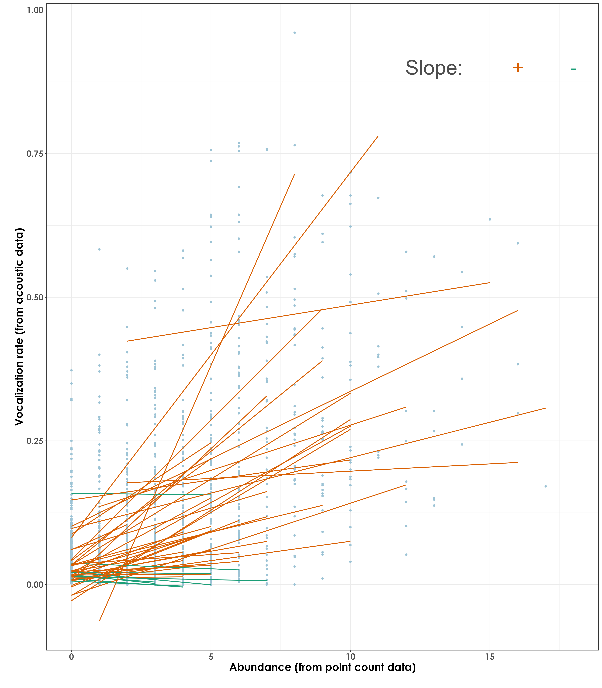
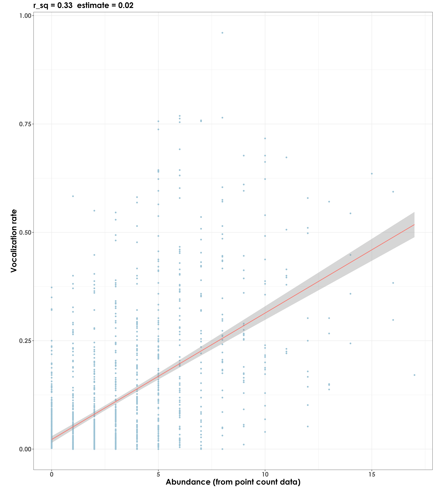

# Abundance vs. vocalization rates

In this script, we model correlations between abundance (as estimated via point count data) and vocalization rates (calculated from acoustic data).

## Install necessary libraries

```{r}
library(tidyverse)
library(dplyr)
library(stringr)
library(vegan)
library(ggplot2)
library(scico)
library(data.table)
library(extrafont)
library(ggstatsplot)
library(ggside)

# Source any custom/other internal functions necessary for analysis
source("code/01_internal-functions.R")
```

## Load dataframe containing point count and acoustic data

```{r}
datSubset <- read.csv("results/datSubset.csv")
```

## Estimate abundance from point count data and calculate vocalization rates from acoustic data

Here, we make a distinction before running correlative analyses that abundance corresponds to the total number of individuals of a species detected across visits to a site and can only be calculated for point count data.

Unlike the previous script, where we used a measure of detections from the acoustic data, we will calculate a measure which we define as vocalization rates. Vocalization rate is calculated as the number of vocalizations (detections across 10-s clips) for a particular time period. Here, time period is defined as the number of total number of 10s-clips across the number of visits to that site. In other words, each site can have ~4 to 5 16-min acoustic surveys at that site.

The total number of acoustic detections for a single acoustic survey can range from 0 to 96, where 96 corresponds to the number of 10-s clips that were analyzed across the 16-min window. If there were 4 or 5 visits to a site, this number can range from 0 to (384/480) [in other words, 96x4 or 96x5].

Hence, the vocalization rate for each species at a site is defined as (x number of vocalizations)/(total number of 10-s clips analyzed). The total number of 10-s clips analyzed can vary depending on the number of visits to the site.

```{r}
# point-count data
# estimate total abundance of all species for each site
abundance <- datSubset %>%
  filter(data_type == "point_count") %>%
  group_by(site_id, restoration_type, scientific_name,
           common_name, eBird_codes) %>% 
  summarise(abundance_pc = sum(number)) %>%
  ungroup()

# for acoustic data, we will first estimate the number of visits to a site, which will essentially translate to the number of 10-s clips that were analyzed/heard (used here as the time period for the calculation of vocalization rates)

# nVisits is calculated here
# except for INBS04U, all other sites had a total of 5 visits, while INBS04U had 4 visits
nSitesDays <- datSubset %>%
  filter(data_type == "acoustic_data") %>%
  dplyr::select(site_id, date)%>%
  distinct() %>% arrange(site_id) %>% count(site_id) %>%
  rename(nVisits = n)

# estimate total number of detections across the acoustic data
# note: we cannot call this abundance as it refers to the total number of vocalizations across all sites
detections <- datSubset %>%
  filter(data_type == "acoustic_data") %>%
  group_by(site_id, restoration_type, scientific_name,
           common_name, eBird_codes) %>% 
  summarise(detections_aru = sum(number)) %>%
  ungroup()

# estimating vocalization rates for each species for each site
vocRate <- detections %>%
  left_join(., nSitesDays, by = "site_id") %>%
  mutate(nClips = nVisits*96) %>%
  mutate(vocRate = detections_aru/nClips)

# Note that the column vocRate can vary between 0 to 1 for each species for each site (this value can vary across sites for each species, referring to how vocally active a species is)
```

## Correlations between abundance and vocalization rates

```{r}
# create a single dataframe
data <- full_join(abundance, vocRate)%>%
  replace_na(list(abundance_pc = 0, detections_aru = 0,
                  nVisits = 0, nClips = 0, vocRate = 0))

# only those species that have a minimum abundance value of 10 and minimum detection value of 10
spp_subset <-  data %>%
  group_by(scientific_name) %>%
  summarise(abundance_pc = sum(abundance_pc), detections_aru = sum(detections_aru)) %>%
  ungroup() %>%
  filter(abundance_pc >=10 & detections_aru >= 10)

# subset data
data <- data %>%
  filter(scientific_name %in% spp_subset$scientific_name)

# reordering factors for plotting
data$restoration_type <- factor(data$restoration_type, levels = c("BM", "AR", "NR"))

# visualization
fig_abund_vocRate_cor <- grouped_ggscatterstats(
  data = data,
  x = vocRate,
  y = abundance_pc,
  grouping.var = restoration_type,
  type = "r",
  plotgrid.args = list(nrow = 3, ncol = 1),
  ggplot.component = list(theme(text = element_text(family = "Century Gothic", size = 15, face = "bold"),plot.title = element_text(family = "Century Gothic",
      size = 18, face = "bold"),
      plot.subtitle = element_text(family = "Century Gothic", 
      size = 15, face = "bold",color="#1b2838"),
      axis.title = element_text(family = "Century Gothic",
      size = 15, face = "bold"))))

ggsave(fig_abund_vocRate_cor, filename = "figs/fig_abundance_vs_vocRates_correlations.png", width = 14, height = 16, device = png(), units = "in", dpi = 300)
dev.off() 
```


## Regressions between abundance and vocalization rates  

```{r}
data <- setDT(data)

# extract t-value
data[,  t_value := summary(lm(vocRate ~ abundance_pc))$coefficients[6], by = scientific_name] 

# extract slope
data[,  slope := lm(vocRate ~ abundance_pc)%>% coef()%>% nth(2), by = scientific_name] 

# extract pearson's correlation
data[,  pearson := cor(vocRate, abundance_pc), by = scientific_name] 

# extract adjusted r squared
data[,  r_sq := summary(lm(vocRate ~ abundance_pc))$adj.r.squared, by = scientific_name] 

# create a column with the direction of the slope (whether it is positive or negative), which can be referred to later while plotting    
data[, slope_dir := ifelse(slope >0, '+', '-')]
paste("Positive regressions:",length(unique(data$scientific_name[data$slope_dir %in% c('+')])))
# 39 species had a positive regression or slope value

## visualization
fig_abund_vocRate_reg <- ggplot(data, aes(y = vocRate,
                                              x = abundance_pc)) +
  geom_point(color = "#9CC3D5",size = 1.2) +
  geom_smooth(data = data, aes(group = scientific_name,
                                     color = slope_dir), 
              method = 'lm', se = FALSE, 
              linewidth = 0.7) +
  scale_color_manual(values=c("#1B9E77", "#D95F02")) +
  labs(y="\nVocalization rate (from acoustic data)", 
       x="Abundance (from point count data)\n") + 
  theme_bw() +
  annotate("text", x=13, y=0.9, 
           label= "Slope:", col = "grey30", size = 12) + 
  annotate("text", x=16, y=0.9, 
           label= "+", col = "#D95F02", size = 12) + 
  annotate("text", x = 18, y=0.9, 
           label = "-", col = "#1B9E77", size = 12)+
  theme(text = element_text(family = "Century Gothic", size = 18, face = "bold"),plot.title = element_text(family = "Century Gothic",
      size = 18, face = "bold"),
      plot.subtitle = element_text(family = "Century Gothic", 
      size = 15, face = "bold",color="#1b2838"),
      axis.title = element_text(family = "Century Gothic",
      size = 18, face = "bold"),
      legend.position = "none")

ggsave(fig_abund_vocRate_reg, filename = "figs/fig_abundance_vs_vocRates_regressions.png", width = 14, height = 16, device = png(), units = "in", dpi = 300)
dev.off() 

# extract the slope, t_value, pearson correlation and the adjusted r square
lm_output <- data %>%
  dplyr::select(scientific_name, t_value, slope, pearson, slope_dir,r_sq) %>% distinct()

# write the values to file
write.csv(lm_output, "results/abundance-vocRates-regressions.csv",
          row.names = F)
```

## Plotting species-specific regression plots  

```{r}
# visualization
plots <- list()

for(i in 1:length(unique(data$scientific_name))){
  
  # extract species scientific name
  a <- unique(data$scientific_name)[i]
  
  # subset data for plotting
  for_plot <- data[data$scientific_name==a,]
  
  # create plots
  plots[[i]] <- ggplot(for_plot, aes(y = vocRate,
                                    x = abundance_pc)) +
  geom_point(color = "#9CC3D5",size = 1.2) +
  geom_smooth(aes(color = "#D95F02"),
    method = 'lm', se = TRUE, 
              linewidth = 0.7) +
    labs(title = paste0(a,"  ","r_sq = ", signif(for_plot$r_sq, digits = 2), "  ", paste0("slope = ",signif(for_plot$slope, digits = 4))),
      y="\nVocalization rates (from acoustic data)", 
       x="Abundance (from point count data)\n") +
    theme_bw() +
  theme(text = element_text(family = "Century Gothic", size = 18, face = "bold"),plot.title = element_text(family = "Century Gothic",
      size = 18, face = "bold"),
      plot.subtitle = element_text(family = "Century Gothic", 
      size = 15, face = "bold",color="#1b2838"),
      axis.title = element_text(family = "Century Gothic",
      size = 18, face = "bold"),
      legend.position = "none")
}

# plot and save as a single pdf
cairo_pdf(
  filename = "figs/abundance-vocRates-by-species-regressions.pdf",
  width = 13, height = 12,
  onefile = TRUE
)
plots
dev.off() 
```

## Community-level regressions  

In this visualization, we essentially plot overall data of acoustic detections against abundance (from point count data)  

```{r}
comm_reg <- lm(vocRate ~ abundance_pc, data=data)
summary(comm_reg)

# Call:
# lm(formula = vocRate ~ abundance_pc, data = data)

# Residuals:
#     Min       1Q   Median       3Q      Max 
# -0.34720 -0.06162 -0.01993  0.03007  0.70498 

# Coefficients:
#             Estimate Std. Error t value Pr(>|t|)    
# (Intercept)  0.022013   0.003962   5.555 3.22e-08 ***
# abundance_pc 0.029178   0.001018  28.674  < 2e-16 ***

# Residual standard error: 0.1185 on 1670 degrees of freedom
# Multiple R-squared:  0.3299,	Adjusted R-squared:  0.3295 
# F-statistic: 822.2 on 1 and 1670 DF,  p-value: < 2.2e-16

# visualization
fig_abund_vocRate_comm_reg <- ggplot(data, aes(y = vocRate,x = abundance_pc)) +
  geom_point(color = "#9CC3D5",size = 1.2) +
  geom_smooth(aes(color = "#D95F02"),
    method = 'lm', se = TRUE, 
              linewidth = 0.7) +
    labs(title = paste0("r_sq = 0.33", "  ", paste0("estimate = 0.02")),
      y="\nVocalization rate", 
       x="Abundance (from point count data)\n") +
    theme_bw() +
  theme(text = element_text(family = "Century Gothic", size = 18, face = "bold"),plot.title = element_text(family = "Century Gothic",
      size = 18, face = "bold"),
      plot.subtitle = element_text(family = "Century Gothic", 
      size = 15, face = "bold",color="#1b2838"),
      axis.title = element_text(family = "Century Gothic",
      size = 18, face = "bold"),
      legend.position = "none") 

ggsave(fig_abund_vocRate_comm_reg, filename = "figs/fig_abundance_vs_vocRates_regressions_communityLevel.png", width = 14, height = 16, device = png(), units = "in", dpi = 300)
dev.off() 
```

