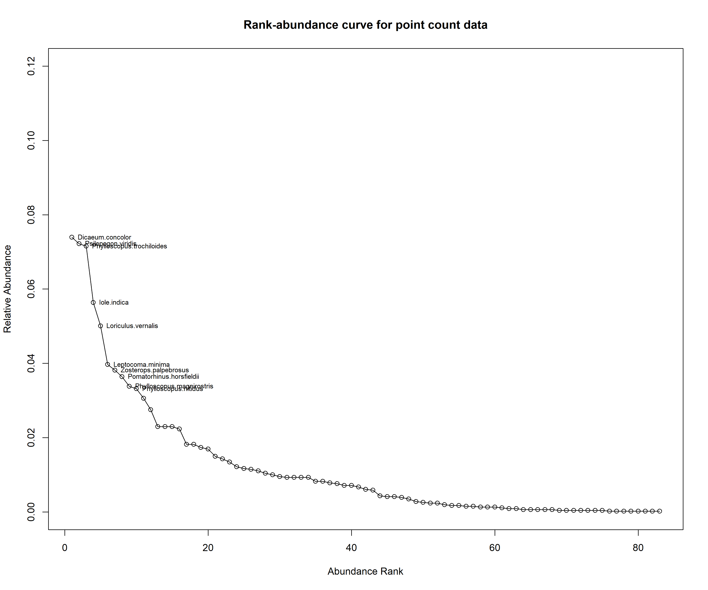
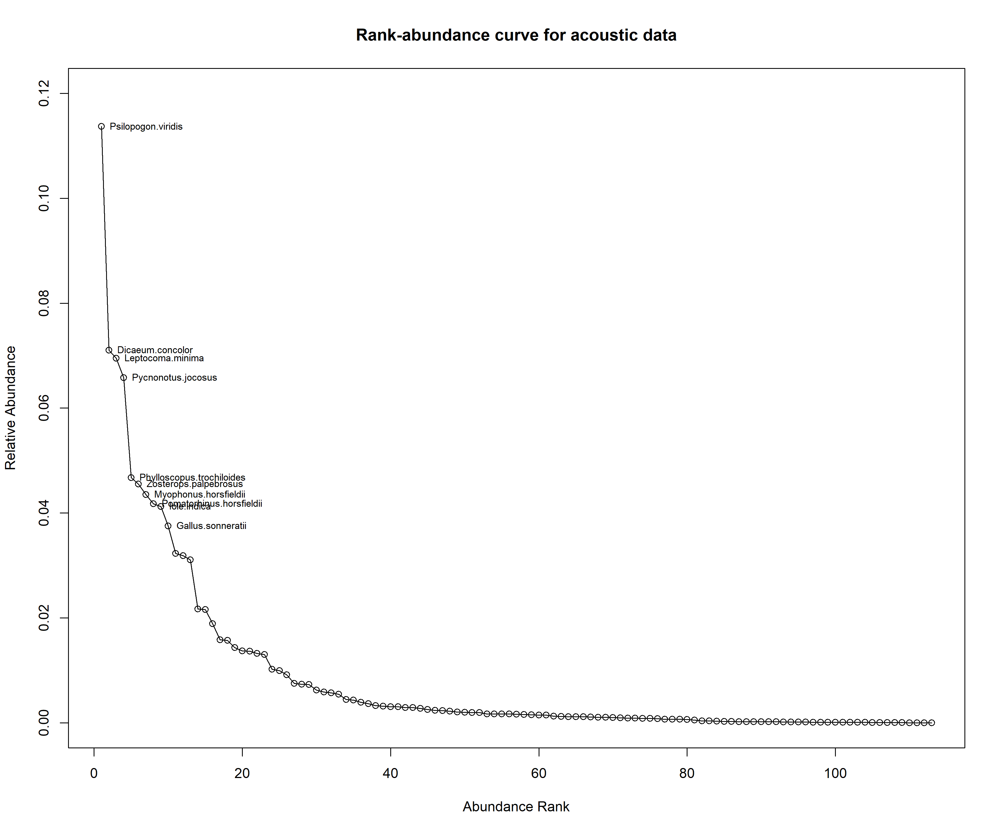
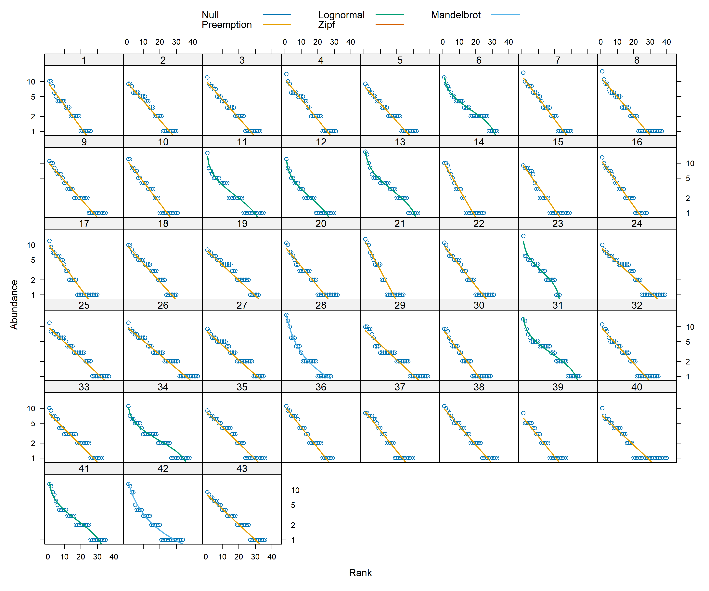
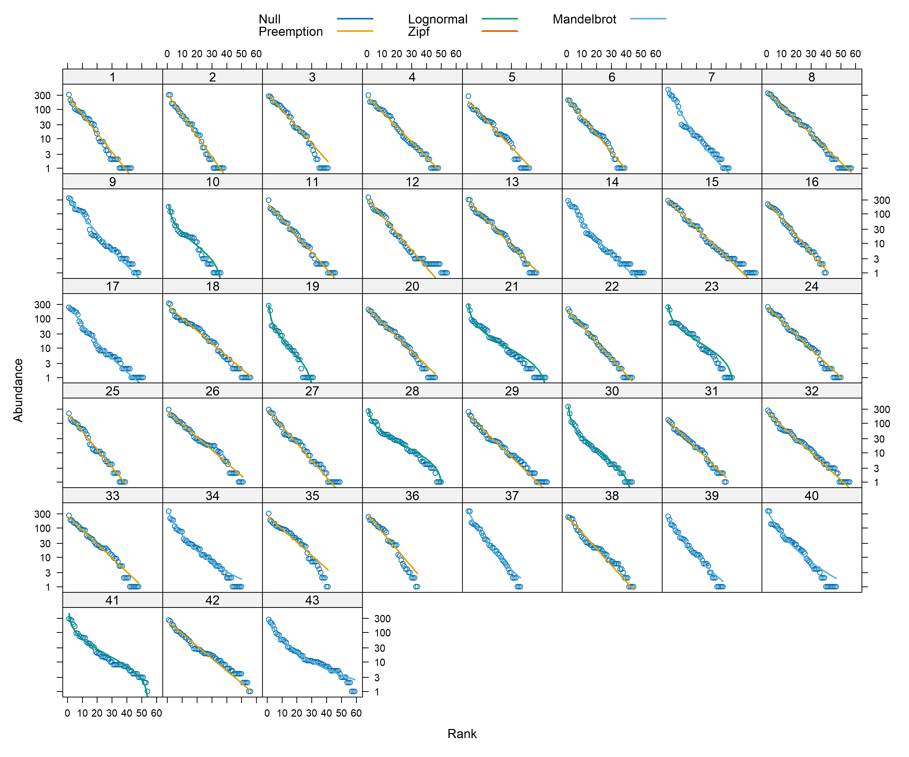

# Rank abundance curves for point count and acoustic data   

Rank abundance curves have been used in ecological analyses for multiple decades now. In this script, we ask if the species that are the most abundant, also the ones that have the highest number of acoustic detections.  
## Install necessary libraries
```{r}
library(tidyverse)
library(dplyr)
library(stringr)
library(vegan)
library(ggplot2)
library(scico)
library(data.table)
library(extrafont)
library(ggstatsplot)
library(ggside)
library(goeveg)

# Source any custom/other internal functions necessary for analysis
source("code/01_internal-functions.R")
```

## Load dataframe containing point count and acoustic data
```{r}
datSubset <- read.csv("results/datSubset.csv")
```

## Estimate abundance for point count data and detections for acoustic data    
Here, we make a distinction before running correlative analyses that abundance corresponds to the total number of individuals of a species detected across visits to a site and can only be calculated for point count data. In the acoustic dataset, individuals are not seen and a measure of detections (estimated as the total number of times as species was heard across ~576 10-s clips). Here 576 clips correspond to the total amount of acoustic data - 96 min (576 10-s clips) of data = 16-min of data for every visit).  
```{r}
# point-count data
# estimate total abundance across all species for each site
abundance <- datSubset %>%
  filter(data_type == "point_count") %>%
  group_by(site_id, scientific_name) %>% 
  summarise(abundance_pc = sum(number)) %>%
  ungroup()

# estimate total number of detections across the acoustic data
# note: we cannot call this abundance as it refers to the total number of vocalizations across all sites
detections <- datSubset %>%
  filter(data_type == "acoustic_data") %>%
  group_by(site_id, scientific_name) %>% 
  summarise(detections_aru = sum(number)) %>%
  ungroup()
```

## Create rank abundance curves  
```{r}
## preparing the point count data for the creation of rank abundance curves
pc_rank <-  abundance %>%
  group_by(site_id) %>%
  pivot_wider(names_from = scientific_name, 
               values_from = abundance_pc, 
               values_fill = list(abundance_pc=0)) %>% ungroup()

pc_rank_mat <- as.matrix(pc_rank[, 2:ncol(pc_rank)])

png(filename = "figs/fig_pointCount_rankCurve.png", width = 12, height = 10, units = "in", res = 300)
pc_rank_curve <- racurve(pc_rank_mat, nlab = 10, main = "Rank-abundance curve for point count data")
dev.off()

## preparing the acoustic data for the creation of rank abundance curves
aru_rank <-  detections %>%
  group_by(site_id) %>%
  pivot_wider(names_from = scientific_name, 
               values_from = detections_aru, 
               values_fill = list(detections_aru=0)) %>% ungroup()

aru_rank_mat <- as.matrix(aru_rank[, 2:ncol(aru_rank)])

png(filename = "figs/fig_acoustic_rankCurve.png", width = 12, height = 10, units = "in", res = 300)
aru_rank_curve <- racurve(aru_rank_mat, nlab = 10, main = "Rank-abundance curve for acoustic data")
dev.off()
```

    

     
  
Based on the above two figures, we observe that the species that made up the top ten ranks are similar across methods, except the ranks are different.   

## Rank-abundance models  

Here, we fit brokenstick, preemption, log-Normal, Zipf and Zipf-Mandelbrot models of species abundance to ask if the data on abundance (from point count data) takes on a similar model of rank-abundance as data from acoustic surveys.  

```{r}
pc_model<- radfit(pc_rank_mat)
aru_model <- radfit(aru_rank_mat)

png(filename = "figs/fig_pointCount_rankModel.png", width = 12, height = 10, units = "in", res = 300)
plot(pc_model)
dev.off()

png(filename = "figs/fig_acousticData_rankModel.png", width = 12, height = 10, units = "in", res = 300)
plot(aru_model)
dev.off()
```

    

     
   
_vegan_ has five models, each with characteristic rank-abundance curve shapes:  
•	Pre-emption (geometric series)  
•	Broken stick  
•	Log-normal  
•	Mandelbrot (also called Zipf-Mandelbrot)  
•	Zipf   

These and other rank-abundance models fall into two camps: one group is based on assumptions of niche partitioning and competition that limits species’ abundances, and the other is based on the statistical behavior of large samples.   

The results suggests that across sites for both point count and acoustic data, majority of the data follow a preemption model (essentially, a geometric series). For more details regarding the models, please see this useful resource: https://myweb.ttu.edu/nmcintyr/Community%20Ecology/abundance.docx (this link will take you a word document that was written by Dr. Nancy McIntyre -http://myweb.ttu.edu/nmcintyr/).  

The big takeway from running these rank abundance models are that majority of the sites seem to show a similar distribution of data across the approaches.   

