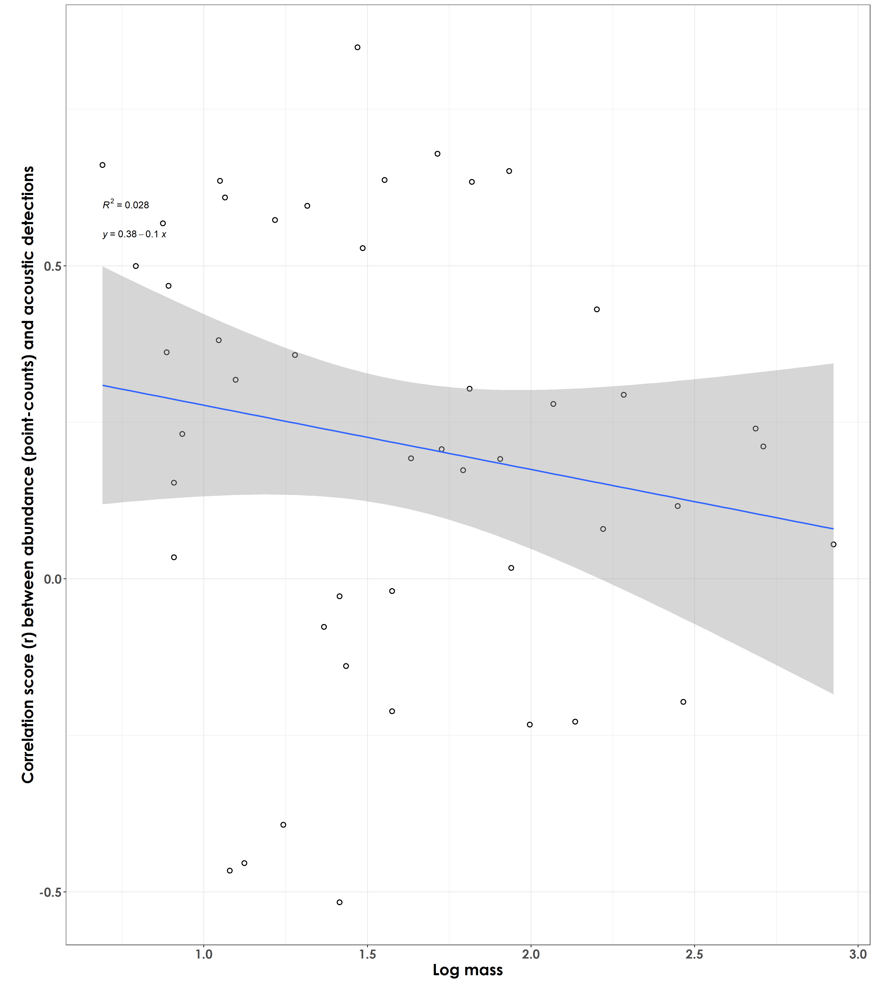
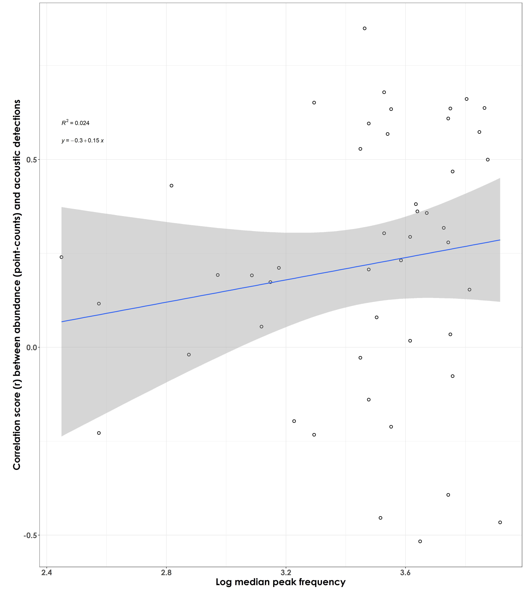

# r value vs. species traits  

In this script, we will plot the correlation scores (derived from the abundance vs. detections script) against species-specific traits to test if the strength of correlation varies as a function of species traits.  

## Load necessary libraries
```{r}
library(tidyverse)
library(dplyr)
library(stringr)
library(vegan)
library(ggplot2)
library(scico)
library(psych)
library(ecodist)
library(RColorBrewer)
library(ggforce)
library(ggpubr)
library(ggalt)
library(patchwork)
library(sjPlot)
library(ggside)
library(ggstatsplot)
library(extrafont)

# Source any custom/other internal functions necessary for analysis
source("code/01_internal-functions.R")
```

## Load species trait data and frequency data
```{r}
trait <- read.csv("data/species-trait-dat.csv")
freq <- read.csv("data/frequency-data.csv")
```

## Load correlation scores from previous script  
```{r}
corr <- read.csv("results/correlationScores-abundance-detections.csv")
```

## Body mass and correlation scores  

Are species of a certain body mass showing stronger/poorer correlations/effect size scores (between abundance and acoustic detections)?
```{r}
corr_trait <- left_join(corr, trait, by = "scientific_name")

# log transform body mass
corr_trait$log_mass <- log10(corr_trait$mass)

# visualization
fig_bodyMass_rValue <- ggplot(corr_trait, aes(x=log_mass,y=estimate)) +  
  geom_point(shape = 21, colour = "black", fill = "white", size = 2, stroke = 1)+ geom_smooth(method="lm", se=TRUE, fullrange=FALSE, level=0.95,linetype="solid") +  theme_bw() +
  stat_regline_equation(label.y = 0.55, aes(label = ..eq.label..)) +
  stat_regline_equation(label.y = 0.6, aes(label = ..rr.label..)) +
  labs(y="\nCorrelation score (r) between abundance (point-counts) and acoustic detections", 
       x="Log mass\n") +
  theme(text = element_text(family = "Century Gothic", size = 18, face = "bold"),plot.title = element_text(family = "Century Gothic",
      size = 18, face = "bold"),
      plot.subtitle = element_text(family = "Century Gothic", 
      size = 15, face = "bold",color="#1b2838"),
      axis.title = element_text(family = "Century Gothic",
      size = 18, face = "bold"))

ggsave(fig_bodyMass_rValue, filename = "figs/fig_bodyMass_rValue.png", width = 14, height = 16, device = png(), units = "in", dpi = 300)
dev.off() 
```


## Median peak frequency and correlation scores  

Are species that vocalize at a certain peak frequency showing stronger/poorer correlations/effect size scores (between abundance and acoustic detections)?
```{r}
# calculate median peak frequency
median_pf <- freq %>%
  group_by(eBird_codes) %>%
  summarise(median_peak_freq =  median(peak_freq_in_Hz))

# join with the above dataframe that contains correlation scores
corr_trait <- left_join(corr_trait, median_pf, by = "eBird_codes")

# log transform median peak frequency
corr_trait$log_freq <- log10(corr_trait$median_peak_freq)

# visualization
fig_medianPeakFreq_rValue <- ggplot(corr_trait, aes(x=log_freq,y=estimate)) +  
  geom_point(shape = 21, colour = "black", fill = "white", size = 2, stroke = 1)+ geom_smooth(method="lm", se=TRUE, fullrange=FALSE, level=0.95,linetype="solid") +  theme_bw() +
  stat_regline_equation(label.y = 0.55, aes(label = ..eq.label..)) +
  stat_regline_equation(label.y = 0.6, aes(label = ..rr.label..)) +
  labs(y="\nCorrelation score (r) between abundance (point-counts) and acoustic detections", 
       x="Log median peak frequency\n") +
  theme(text = element_text(family = "Century Gothic", size = 18, face = "bold"),plot.title = element_text(family = "Century Gothic",
      size = 18, face = "bold"),
      plot.subtitle = element_text(family = "Century Gothic", 
      size = 15, face = "bold",color="#1b2838"),
      axis.title = element_text(family = "Century Gothic",
      size = 18, face = "bold"))

ggsave(fig_medianPeakFreq_rValue, filename = "figs/fig_medianPeakFreq_rValue.png", width = 14, height = 16, device = png(), units = "in", dpi = 300)
dev.off() 
```


