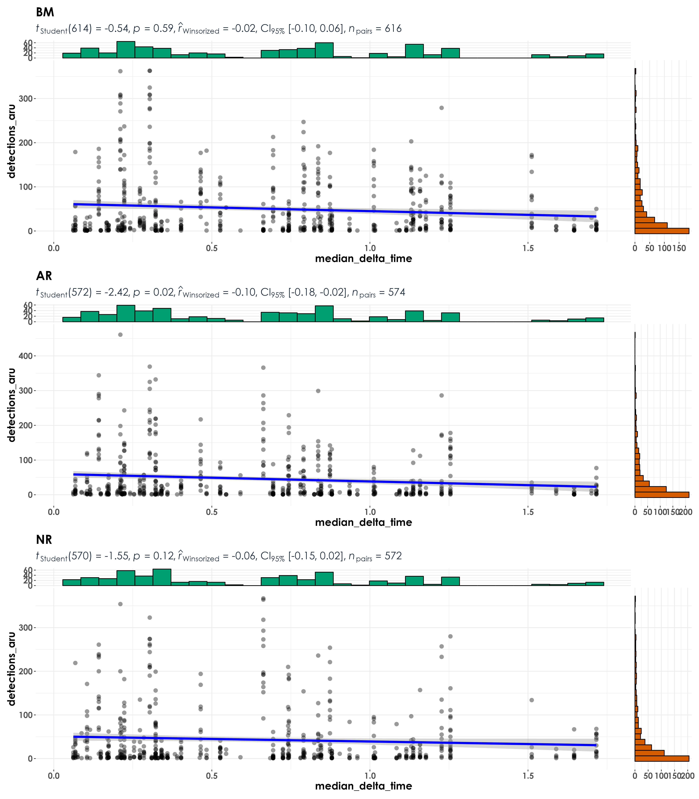
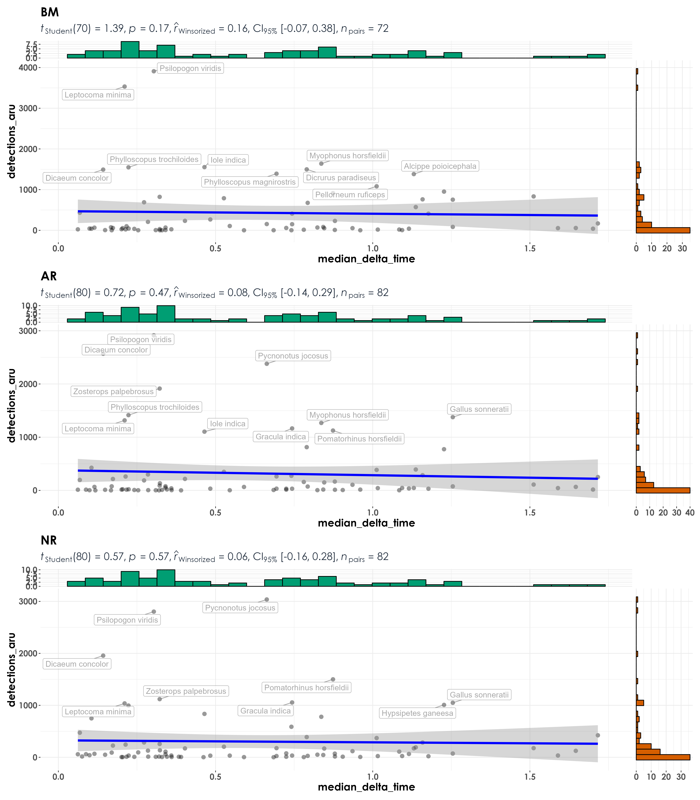

# Acoustic detections vs. vocalization duration  

In this script, we will explore if species with relatively high detections per have shorter vocalizations (in duration).  

## Load necessary libraries
```{r}
library(tidyverse)
library(dplyr)
library(stringr)
library(vegan)
library(ggplot2)
library(scico)
library(psych)
library(ecodist)
library(RColorBrewer)
library(ggforce)
library(ggpubr)
library(ggalt)
library(patchwork)
library(sjPlot)
library(ggside)
library(ggstatsplot)
library(extrafont)

# Source any custom/other internal functions necessary for analysis
source("code/01_internal-functions.R")
```

## Load dataframe containing point count and acoustic data
```{r}
datSubset <- read.csv("results/datSubset.csv")
```

## Load frequency data
```{r}
freq <- read.csv("data/frequency-data.csv")
```

## Estimate detections for acoustic data    

In the acoustic dataset, individuals are not seen and a measure of detections (estimated as the total number of times as species was heard across ~576 10-s clips). Here 576 clips correspond to the total amount of acoustic data - 96 min (576 10-s clips) of data = 16-min of data for every visit).  
```{r}
# estimate total number of detections across the acoustic data
# note: we cannot call this abundance as it refers to the total number of vocalizations across all sites
detections <- datSubset %>%
  filter(data_type == "acoustic_data") %>%
  group_by(site_id, restoration_type, scientific_name,
           common_name, eBird_codes) %>% 
  summarise(detections_aru = sum(number)) %>%
  ungroup()
```


## Process frequency data  

We will extract the median delta time (difference between begin and end time for each vocalization) for each species. Note: For a total of 114 species, template recordings (varying from a minimum of 2 templates to 1910 templates per species) was extracted by Meghana P Srivathsa. While extracting delta time, no distinction was made between songs and calls.  
```{r}
# how many templates exist across species
# minimum templates = 2; maximum templates = 1910
nTemplates <- freq %>%
  group_by(eBird_codes) %>%
  count()

# We only include species with a minimum of 10 templates
# Only a total of 87 species are left after filtering species with very few templates
nTemplates_10 <- freq %>%
  group_by(eBird_codes) %>%
  count() %>%
  filter(n >= 10)

# left-join to remove species with less than 10 templates in the frequency dataset
freq_10 <- left_join(nTemplates_10[,1], freq)

# calculate median delta time
median_time_10 <- freq_10 %>%
  group_by(eBird_codes) %>%
  summarise(median_delta_time =  median(delta_time_in_s))
```

## Correlations between acoustic detections and median delta time   
```{r}
# create a single dataframe
data <- left_join(detections, median_time_10, by = "eBird_codes") %>%
  drop_na() %>%
  filter(median_delta_time < 2) # remove outliers in the above data

# reordering factors for plotting
data$restoration_type <- factor(data$restoration_type, levels = c("BM", "AR", "NR"))

# visualization
fig_detec_duration <- grouped_ggscatterstats(
  data = data,
  x = median_delta_time,
  y = detections_aru,
  grouping.var = restoration_type,
  type = "r",
  plotgrid.args = list(nrow = 3, ncol = 1),
  ggplot.component = list(theme(text = element_text(family = "Century Gothic", size = 15, face = "bold"),plot.title = element_text(family = "Century Gothic",
      size = 18, face = "bold"),
      plot.subtitle = element_text(family = "Century Gothic", 
      size = 15, face = "bold",color="#1b2838"),
      axis.title = element_text(family = "Century Gothic",
      size = 15, face = "bold"))))

ggsave(fig_detec_duration, filename = "figs/fig_detections_vs_duration.png", width = 14, height = 16, device = png(), units = "in", dpi = 300)
dev.off() 
```

  
  
## Combine site-level data to test for correlations between detections and median delta time for each species (at the level of the treatment type)    

Here, each dot in the visualization refers to a particular species and the only difference between this analysis and previous one is that the site-level variation is compressed/lost and the visualization/correlative analyses are being carried out across species and treatment types. 
```{r}
# grouping acoustic data at the level of the treatment type
detections_group <- data %>%
  group_by(restoration_type, scientific_name,
           common_name, eBird_codes, median_delta_time) %>% 
  summarise(detections_aru = sum(detections_aru)) %>%
  ungroup()

# reordering factors for plotting
detections_group$restoration_type <- factor(detections_group$restoration_type, levels = c("BM", "AR", "NR"))

# visualization
fig_detec_duration_group <- grouped_ggscatterstats(
  data = detections_group,
  x = median_delta_time,
  y = detections_aru,
  grouping.var = restoration_type,
  type = "r",
  label.var = scientific_name, 
  label.expression = detections_aru > 1000, 
  point.label.args = list(alpha = 0.7, size = 4, color = "grey50"),
  plotgrid.args = list(nrow = 3, ncol = 1),
  ggplot.component = list(theme(text = element_text(family = "Century Gothic", size = 15, face = "bold"),plot.title = element_text(family = "Century Gothic",
      size = 18, face = "bold"),
      plot.subtitle = element_text(family = "Century Gothic", 
      size = 15, face = "bold",color="#1b2838"),
      axis.title = element_text(family = "Century Gothic",
      size = 15, face = "bold"))))

ggsave(fig_detec_duration_group, filename = "figs/fig_detections_vs_duration_grouped.png", width = 14, height = 16, device = png(), units = "in", dpi = 300)
dev.off() 
```

 
