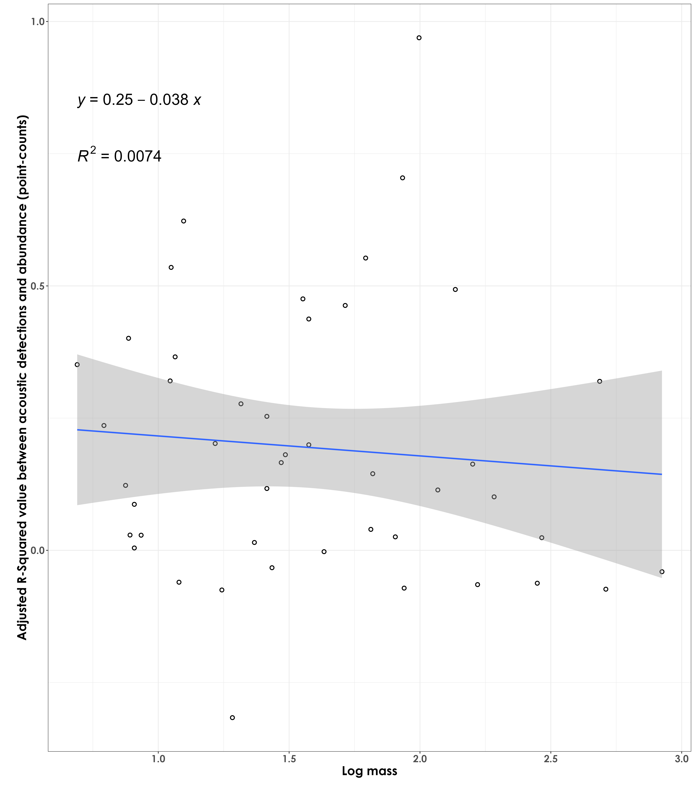
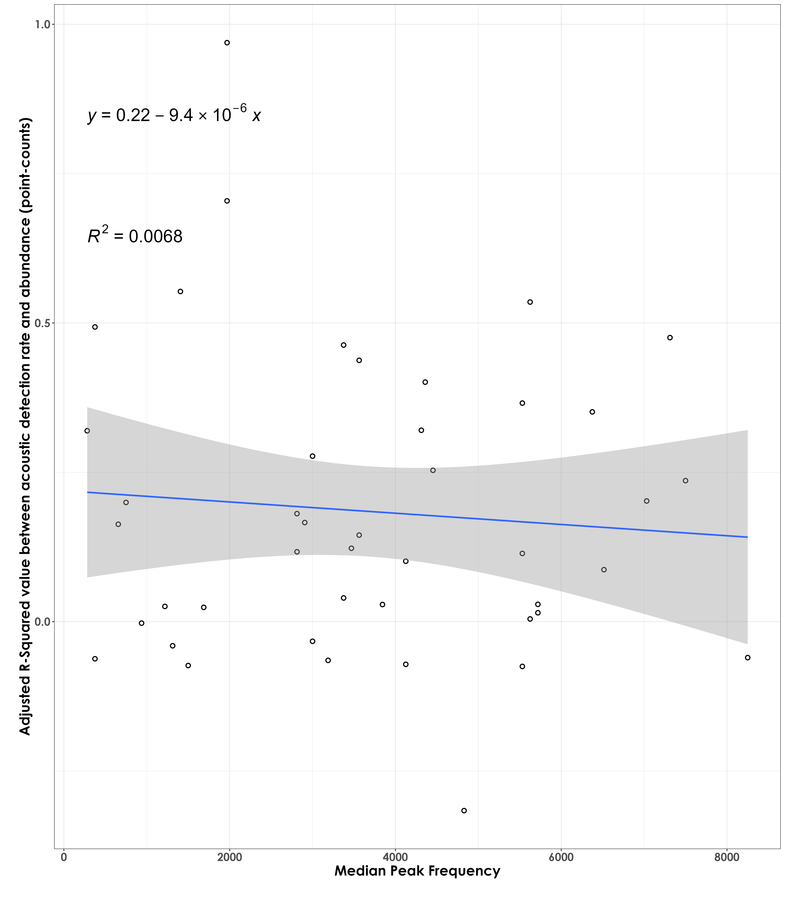
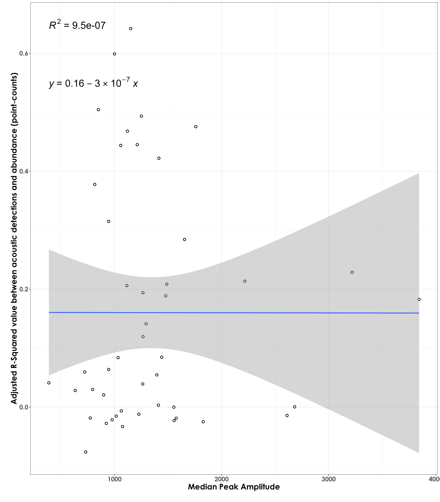

# r sq vs. species traits  

In this script, we will plot the adjusted r squared values (derived from the abundance vs. detections script) against species-specific traits.  

## Load necessary libraries
```{r}
library(tidyverse)
library(dplyr)
library(stringr)
library(vegan)
library(ggplot2)
library(scico)
library(psych)
library(ecodist)
library(RColorBrewer)
library(ggforce)
library(ggpubr)
library(ggalt)
library(patchwork)
library(sjPlot)
library(ggside)
library(ggstatsplot)
library(extrafont)

# Source any custom/other internal functions necessary for analysis
source("code/01_internal-functions.R")
```

## Load species trait data and frequency data
```{r}
trait <- read.csv("data/species-trait-dat.csv")
freq <- read.csv("data/frequency-data.csv")
```

## Load adjusted r squared values from previous script  
```{r}
r_sq <- read.csv("results/abundance-detections-regressions.csv")
```

## Body mass and R squared values 

Are species of a certain body mass showing stronger/poorer R squared values (between abundance and acoustic detections)?
```{r}
r_sq_trait <- left_join(r_sq, trait, by = "scientific_name")

# log transform body mass
r_sq_trait$log_mass <- log10(r_sq_trait$mass)

# visualization
fig_bodyMass_rSqValue <- ggplot(r_sq_trait, aes(x=log_mass,y=r_sq)) +  geom_point(shape = 21, colour = "black", fill = "white", size = 2, stroke = 1)+ 
  geom_smooth(method="lm", se=TRUE, fullrange=FALSE, level=0.95,linetype="solid") +  
  theme_bw() +
  stat_regline_equation(label.y = 0.55, aes(label = ..eq.label..),
                        size = 8) +
  stat_regline_equation(label.y = 0.65, aes(label = ..rr.label..),
                        size = 8) +
  labs(y="\nAdjusted R-Squared value between acoustic detections and abundance (point-counts)", 
       x="Log mass\n") +
  theme(text = element_text(family = "Century Gothic", size = 18, face = "bold"),plot.title = element_text(family = "Century Gothic",
      size = 18, face = "bold"),
      plot.subtitle = element_text(family = "Century Gothic", 
      size = 15, face = "bold",color="#1b2838"),
      axis.title = element_text(family = "Century Gothic",
      size = 18, face = "bold"))

ggsave(fig_bodyMass_rSqValue, filename = "figs/fig_bodyMass_adjustedrSq.png", width = 14, height = 16, device = png(), units = "in", dpi = 300)
dev.off() 
```

  

## Median peak frequency and R squared values  

```{r}
# Only a total of 87 species are left after filtering species with very few templates
nTemplates_10 <- freq %>%
  group_by(eBird_codes) %>%
  count() %>%
  filter(n >= 10)

# left-join to remove species with less than 10 templates in the frequency dataset
freq_10 <- left_join(nTemplates_10[,1], freq)

# calculate median peak frequency
median_pf <- freq_10 %>%
  group_by(eBird_codes) %>%
  summarise(median_peak_freq =  median(peak_freq_in_Hz))

# add scientific_name to median_pf
median_pf <- left_join(median_pf, trait[,c(1,4)], by = "eBird_codes")

# join r sq and median pf dataframes
r_sq_freq <- left_join(r_sq, median_pf, by = "scientific_name")

# visualization
fig_medianPeakFreq_rSqValue <- ggplot(r_sq_freq, aes(x=median_peak_freq,y=r_sq)) +  geom_point(shape = 21, colour = "black", fill = "white", size = 2, stroke = 1)+ 
  geom_smooth(method="lm", se=TRUE, fullrange=FALSE, level=0.95,linetype="solid") +  
  theme_bw() +
  stat_regline_equation(label.y = 0.55, aes(label = ..eq.label..),
                        size = 8) +
  stat_regline_equation(label.y = 0.65, aes(label = ..rr.label..),
                        size = 8) +
  labs(y="\nAdjusted R-Squared value between acoustic detections and abundance (point-counts)", 
       x="Median Peak Frequency\n") +
  theme(text = element_text(family = "Century Gothic", size = 18, face = "bold"),plot.title = element_text(family = "Century Gothic",
      size = 18, face = "bold"),
      plot.subtitle = element_text(family = "Century Gothic", 
      size = 15, face = "bold",color="#1b2838"),
      axis.title = element_text(family = "Century Gothic",
      size = 18, face = "bold"))

ggsave(fig_medianPeakFreq_rSqValue, filename = "figs/fig_medianPeakFrequency_adjustedrSq.png", width = 14, height = 16, device = png(), units = "in", dpi = 300)
dev.off() 
```

  

## Median peak amplitude and R squared values

```{r}
# calculate median peak amplitude
# we extract only the median of the 95th percentile of values
median_amp <- freq_10 %>%
  group_by(eBird_codes) %>%
  filter(peak_amp >= quantile(peak_amp, 0.95, na.rm = T)) %>%
  summarise(median_peak_amp = median(peak_amp))

# add scientific_name to median_amp
median_amp <- left_join(median_amp, trait[,c(1,4)], by = "eBird_codes")

# join r sq and median amplitude dataframes
r_sq_amp <- left_join(r_sq, median_amp, by = "scientific_name")

# visualization
fig_medianPeakAmplitude_rSqValue <- ggplot(r_sq_amp, aes(x=median_peak_amp,y=r_sq)) +  geom_point(shape = 21, colour = "black", fill = "white", size = 2, stroke = 1)+ 
  geom_smooth(method="lm", se=TRUE, fullrange=FALSE, level=0.95,linetype="solid") +  
  theme_bw() +
  stat_regline_equation(label.y = 0.55, aes(label = ..eq.label..),
                        size = 8) +
  stat_regline_equation(label.y = 0.65, aes(label = ..rr.label..),
                        size = 8) +
  labs(y="\nAdjusted R-Squared value between acoustic detections and abundance (point-counts)", 
       x="Median Peak Amplitude\n") +
  theme(text = element_text(family = "Century Gothic", size = 18, face = "bold"),plot.title = element_text(family = "Century Gothic",
      size = 18, face = "bold"),
      plot.subtitle = element_text(family = "Century Gothic", 
      size = 15, face = "bold",color="#1b2838"),
      axis.title = element_text(family = "Century Gothic",
      size = 18, face = "bold"))

ggsave(fig_medianPeakAmplitude_rSqValue, filename = "figs/fig_medianPeakAmplitude_adjustedrSq.png", width = 14, height = 16, device = png(), units = "in", dpi = 300)
dev.off() 
```

  

## Multiple regressions between adjusted R Squared values and species traits  

We run multiple linear regressions to ask if a particular species trait is more predictive of a stronger association between acoustic detections and abundance (as derived from point count data).  

```{r}
# prep dataframe that includes all adjusted r squared values and species traits

reg_data <- left_join(r_sq_trait, r_sq_freq[,c(1,8)], 
                      by = "scientific_name") %>%
  left_join(., r_sq_amp[,c(1,8)], by = "scientific_name")

# scale predictors prior to running regression
reg_data$mass_scale <- scale(reg_data$mass)
reg_data$freq_scale <- scale(reg_data$median_peak_freq)
reg_data$amp_scale <- scale(reg_data$median_peak_amp)

# run multiple linear regression
mult_regress <- lm(r_sq ~ mass_scale + freq_scale + amp_scale,
                   data = reg_data)
```

Summary of the regression analysis:  

Call:  
lm(formula = r_sq ~ mass_scale + freq_scale + amp_scale, data = reg_data)  

Residuals:  
    Min      1Q  Median      3Q     Max     
-0.2278 -0.1488 -0.0544  0.1280  0.4731   

Coefficients:  
            Estimate Std. Error t value Pr(>|t|)      
(Intercept)  0.16026    0.02961    5.41  2.8e-06 ***  
mass_scale  -0.03540    0.03428   -1.03     0.31      
freq_scale   0.01898    0.03587    0.53     0.60      
amp_scale   -0.00583    0.03057   -0.19     0.85      

Residual standard error: 0.201 on 42 degrees of freedom  
  (2 observations deleted due to missingness)  
Multiple R-squared:  0.0581,	Adjusted R-squared:  -0.0092     
F-statistic: 0.863 on 3 and 42 DF,  p-value: 0.468  

