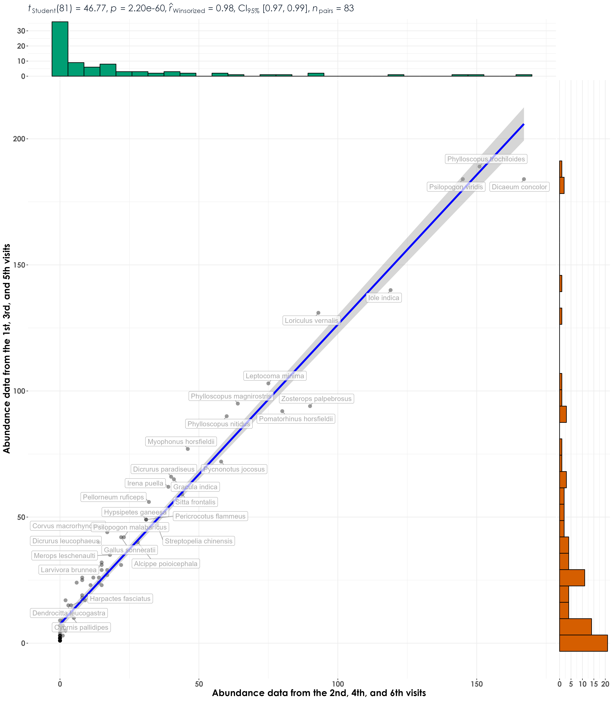
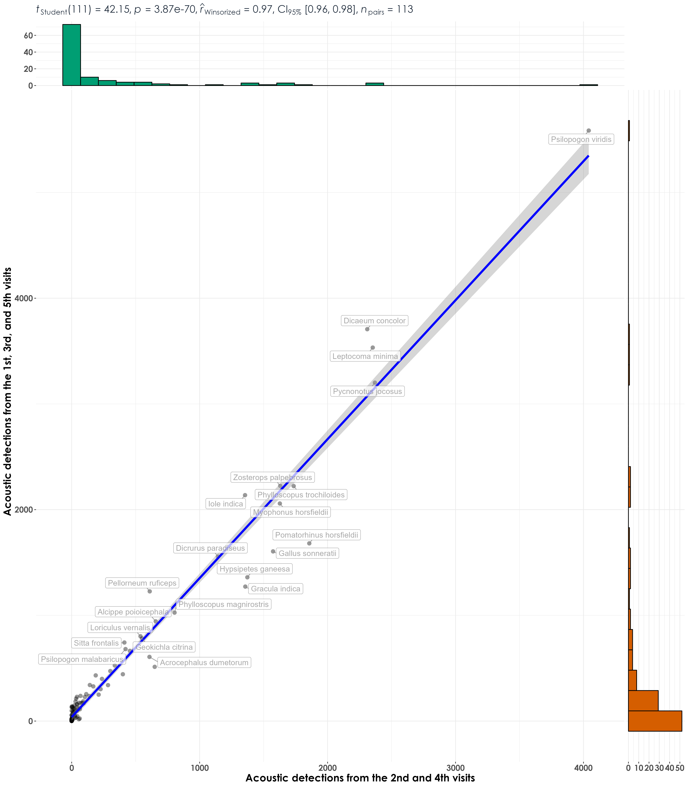

# Abundance and detections repeatability analyses  

In this script, we will subsample data from the point count and acoustic dataset and test if the abundance and acoustic detections are repeatable across seasons.  

## Install necessary libraries
```{r}
library(tidyverse)
library(dplyr)
library(stringr)
library(vegan)
library(ggplot2)
library(scico)
library(data.table)
library(extrafont)
library(ggstatsplot)
library(ggside)
library(MASS)
library(scales)
library(rr2)
library(ggnewscale)
library(ggpubr)
library(gridtext)
library(broom)

# Source any custom/other internal functions necessary for analysis
source("code/01_internal-functions.R")
```

## Load dataframe containing point count and acoustic data
```{r}
datSubset <- read.csv("results/datSubset.csv")
```

## Estimate abundance for point count data and detections for acoustic data  

Here, we make a distinction before running correlative analyses that abundance corresponds to the total number of individuals of a species detected across visits to a site and can only be calculated for point count data. In the acoustic dataset, individuals are not seen and a measure of detections (estimated as the total number of times as species was heard across ~576 10-s clips). Here 576 clips correspond to the total amount of acoustic data - 96 min (576 10-s clips) of data = 16-min of data for every visit). Here, we also add a vist_number column to each object to ease subsampling of data.    
```{r}
# point-count data
# estimate total abundance across all species for each site
# include a vist_number column to sub sample data later on
abundance <- datSubset %>%
  filter(data_type == "point_count") %>%
  group_by(site_id, restoration_type, scientific_name,
           common_name, eBird_codes, date) %>% 
  summarise(abundance_pc = sum(number)) %>%
  mutate(visit_number = row_number()) %>%
  ungroup()

# estimate total number of detections across the acoustic data
# note: we cannot call this abundance as it refers to the total number of vocalizations across all sites
# include a vist_number column to sub sample data later on
detections <- datSubset %>%
  filter(data_type == "acoustic_data") %>%
  group_by(site_id, restoration_type, scientific_name,
           common_name, eBird_codes, date) %>% 
  summarise(detections_aru = sum(number)) %>%
  mutate(visit_number = row_number()) %>%
  ungroup()

# note: we have six visits to each site for point count data but only a maximum of five visits per site for acoustic detections data 
```

## Run analysis at the level of each species (across all sites and treatments combined) for point count data  

Here we run analyses separately for point count data and acoustic data. First, we will filter data by visits (choosing the 1st, 3rd and 5th visit) to a site and calculate total abundance for each species. We will repeat the above by choosing the 2nd, 4th, and 6th visit to a site and calculate total abundance for each species. 
```{r}
# grouping point count data
# 1st, 3rd, and 5th visit
abundance_groupA <- abundance %>%
  filter(visit_number %in% c(1,3,5)) %>%
  group_by(scientific_name,
           common_name, eBird_codes) %>% 
  summarise(abundance_groupA = sum(abundance_pc)) %>%
  ungroup()

# 2nd, 4th, and 6th visit
abundance_groupB <- abundance %>%
  filter(visit_number %in% c(2,4,6)) %>%
  group_by(scientific_name,
           common_name, eBird_codes) %>% 
  summarise(abundance_groupB = sum(abundance_pc)) %>%
  ungroup()

# create a single dataframe
abund_data_group <- full_join(abundance_groupA, abundance_groupB) %>%
  replace_na(list(abundance_groupA = 0, abundance_groupB = 0)) 

# visualization
fig_abund_A_vs_B <- ggscatterstats(
  data = abund_data_group,
  x = abundance_groupB,
  y = abundance_groupA,
  type = "r",
  xlab = "Abundance data from the 2nd, 4th, and 6th visits",
  ylab = "Abundance data from the 1st, 3rd, and 5th visits",
  label.var = scientific_name, 
  label.expression = abundance_groupA > 10, 
  point.label.args = list(alpha = 0.7, size = 4, color = "grey50"),
  plotgrid.args = list(nrow = 3, ncol = 1),
  ggplot.component = list(theme(text = element_text(family = "Century Gothic", size = 15, face = "bold"),plot.title = element_text(family = "Century Gothic",
      size = 18, face = "bold"),
      plot.subtitle = element_text(family = "Century Gothic", 
      size = 15, face = "bold",color="#1b2838"),
      axis.title = element_text(family = "Century Gothic",
      size = 15, face = "bold"))))

ggsave(fig_abund_A_vs_B, filename = "figs/fig_abundance_repeatability_correlations.png", width = 14, height = 16, device = png(), units = "in", dpi = 300)
dev.off() 
```


## Run analysis at the level of each species (across all sites and treatments combined) for acoustic data

First, we will filter data by visits (choosing the 1st, 3rd, and 5th visit) to a site and calculate total detections for each species. We will repeat the above by choosing the 2nd, and 4th visit to a site and calculate total detections for each species. We make a note that we do not have sufficient number of visits to equally divide/subsample them for acoustic data. 
```{r}
# grouping acoustic data
# 1st, 3rd, and 5th visit
detections_groupA <- detections %>%
  filter(visit_number %in% c(1,3,5)) %>%
  group_by(scientific_name,
           common_name, eBird_codes) %>% 
  summarise(detections_groupA = sum(detections_aru)) %>%
  ungroup()

# 2nd and 4th visit
detections_groupB <- detections %>%
  filter(visit_number %in% c(2,4)) %>%
  group_by(scientific_name,
           common_name, eBird_codes) %>% 
  summarise(detections_groupB = sum(detections_aru)) %>%
  ungroup()

# create a single dataframe
detec_data_group <- full_join(detections_groupA, detections_groupB) %>%
  replace_na(list(detections_groupA = 0, detections_groupB = 0)) 

# visualization
fig_detec_A_vs_B <- ggscatterstats(
  data = detec_data_group,
  x = detections_groupB,
  y = detections_groupA,
  type = "r",
  xlab = "Acoustic detections from the 2nd and 4th visits",
  ylab = "Acoustic detections from the 1st, 3rd, and 5th visits",
  label.var = scientific_name, 
  label.expression = detections_groupA > 10, 
  point.label.args = list(alpha = 0.7, size = 4, color = "grey50"),
  plotgrid.args = list(nrow = 3, ncol = 1),
  ggplot.component = list(theme(text = element_text(family = "Century Gothic", size = 15, face = "bold"),plot.title = element_text(family = "Century Gothic",
      size = 18, face = "bold"),
      plot.subtitle = element_text(family = "Century Gothic", 
      size = 15, face = "bold",color="#1b2838"),
      axis.title = element_text(family = "Century Gothic",
      size = 15, face = "bold"))))

ggsave(fig_detec_A_vs_B, filename = "figs/fig_detections_repeatability_correlations.png", width = 14, height = 16, device = png(), units = "in", dpi = 300)
dev.off() 
```



## Mix and match acoustic data and point count surveys  

Here, we create subsets of data that mix and match the abundance data and the acoustic detections to assess repeatability.  

```{r}
detec_abund_group <- full_join(abund_data_group, detec_data_group) %>%
  replace_na(list(detections_groupA = 0, detections_groupB = 0,
                  abundance_groupA = 0, abundance_groupB = 0))

# visualization A
fig_detecA_vs_abundB <- ggscatterstats(
  data = detec_abund_group,
  x = detections_groupA,
  y = abundance_groupB,
  type = "r",
  xlab = "Acoustic detections from the 1st, 3rd and 5th visits",
  ylab = "Abundance data from the 2nd, 4th, and 6th visits",
  label.var = scientific_name, 
  label.expression = detections_groupA > 10, 
  point.label.args = list(alpha = 0.7, size = 4, color = "grey50"),
  plotgrid.args = list(nrow = 3, ncol = 1),
  ggplot.component = list(theme(text = element_text(family = "Century Gothic", size = 15, face = "bold"),plot.title = element_text(family = "Century Gothic",
      size = 18, face = "bold"),
      plot.subtitle = element_text(family = "Century Gothic", 
      size = 15, face = "bold",color="#1b2838"),
      axis.title = element_text(family = "Century Gothic",
      size = 15, face = "bold"))))

ggsave(fig_detecA_vs_abundB, filename = "figs/fig_abundanceGroupB_vs_detectionsGroupA_repeatability_correlations.png", width = 14, height = 16, device = png(), units = "in", dpi = 300)
dev.off() 

# visualization B
fig_detecB_vs_abundA <- ggscatterstats(
  data = detec_abund_group,
  x = detections_groupB,
  y = abundance_groupA,
  type = "r",
  xlab = "Acoustic detections from the 2nd and 4th visits",
  ylab = "Abundance data from the 1st, 3rd, and 5th visits",
  label.var = scientific_name, 
  label.expression = detections_groupB > 10, 
  point.label.args = list(alpha = 0.7, size = 4, color = "grey50"),
  plotgrid.args = list(nrow = 3, ncol = 1),
  ggplot.component = list(theme(text = element_text(family = "Century Gothic", size = 15, face = "bold"),plot.title = element_text(family = "Century Gothic",
      size = 18, face = "bold"),
      plot.subtitle = element_text(family = "Century Gothic", 
      size = 15, face = "bold",color="#1b2838"),
      axis.title = element_text(family = "Century Gothic",
      size = 15, face = "bold"))))

ggsave(fig_detecB_vs_abundA, filename = "figs/fig_abundanceGroupA_vs_detectionsGroupB_repeatability_correlations.png", width = 14, height = 16, device = png(), units = "in", dpi = 300)
dev.off() 

## repeat the above visualizations with regressions
fig_detecA_vs_abundB_reg <- ggplot(detec_abund_group, aes(x=detections_groupA,y=abundance_groupB)) +  geom_point(shape = 21, colour = "black", fill = "white", size = 2, stroke = 1)+ 
  geom_smooth(method="lm", se=TRUE, fullrange=FALSE, level=0.95,linetype="solid") +  
  theme_bw() +
  stat_regline_equation(label.y = 150, aes(label = ..eq.label..),
                        size = 8) +
  stat_regline_equation(label.y = 200, aes(label = ..rr.label..),
                        size = 8) +
  labs(y="Abundance data from the 2nd, 4th, and 6th visits", 
       x="Acoustic detections from the 1st, 3rd, and 5th visits") +
  theme(text = element_text(family = "Century Gothic", size = 18, face = "bold"),plot.title = element_text(family = "Century Gothic",
      size = 18, face = "bold"),
      plot.subtitle = element_text(family = "Century Gothic", 
      size = 15, face = "bold",color="#1b2838"),
      axis.title = element_text(family = "Century Gothic",
      size = 18, face = "bold"))

ggsave(fig_detecA_vs_abundB_reg, filename = "figs/fig_abundanceGroupB_vs_detectionsGroupA_repeatablity_regressions.png", width = 14, height = 16, device = png(), units = "in", dpi = 300)
dev.off() 

fig_detecB_vs_abundA_reg <- ggplot(detec_abund_group, aes(x=detections_groupB,y=abundance_groupA)) +  geom_point(shape = 21, colour = "black", fill = "white", size = 2, stroke = 1)+ 
  geom_smooth(method="lm", se=TRUE, fullrange=FALSE, level=0.95,linetype="solid") +  
  theme_bw() +
  stat_regline_equation(label.y = 150, aes(label = ..eq.label..),
                        size = 8) +
  stat_regline_equation(label.y = 200, aes(label = ..rr.label..),
                        size = 8) +
  labs(y="Abundance data from the 1st, 3rd, and 5th visits", 
       x="Acoustic detections from the 2nd and 4th visits ") +
  theme(text = element_text(family = "Century Gothic", size = 18, face = "bold"),plot.title = element_text(family = "Century Gothic",
      size = 18, face = "bold"),
      plot.subtitle = element_text(family = "Century Gothic", 
      size = 15, face = "bold",color="#1b2838"),
      axis.title = element_text(family = "Century Gothic",
      size = 18, face = "bold"))

ggsave(fig_detecB_vs_abundA_reg, filename = "figs/fig_abundanceGroupA_vs_detectionsGroupB_repeatablity_regressions.png", width = 14, height = 16, device = png(), units = "in", dpi = 300)
dev.off()
```


